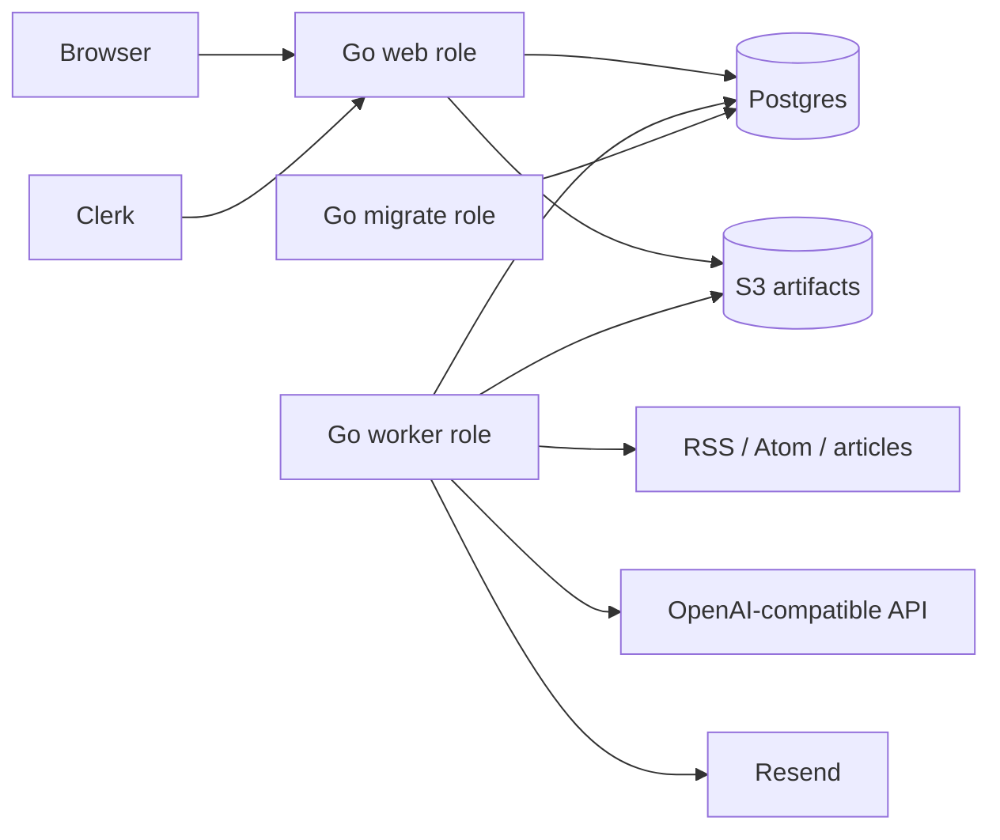

# Architecture

Learnloom is a hosted modular monolith with separately scaled web and worker
processes. The package boundaries follow product responsibilities rather than
transport or framework layers.



## Modules

- `internal/httpapp`: host classification, authentication, request policy,
  control-plane JSON, Clerk lifecycle webhooks, and public reading surfaces.
- `internal/store`: Postgres persistence, scheduling, fair Issue Claims,
  delivery receipts, runtime controls, rate limits, and deletion work.
- `internal/execution`: orchestration only. It renews Claims and coordinates
  Dossier generation, artifact persistence, transactional completion, and
  delivery.
- `internal/source`: bounded acquisition with SSRF and redirect defenses.
- `internal/dossier`: the multi-stage Dossier production pipeline, contract
  repair, deterministic quality gate, and safe rendering.
- `internal/artifact`: checksummed, opaque-key S3 persistence.
- `internal/delivery`: Resend adapter and stable idempotency semantics.
- `internal/domain`: shared hosted product vocabulary and state machines.

Dependencies point inward: adapters implement narrow behavior consumed by the
Dossier and execution modules. HTTP handlers never call model, source, or
email providers directly.

## State and concurrency

Postgres owns mutable state. Workers claim due Issues with `SKIP LOCKED`,
per-Account fairness, expiring leases, renewal tokens, attempt limits, and
recovery of abandoned Claims. Artifact bytes are persisted before an Issue is
transactionally marked generated. Delivery is a separate Claim so a retry
never spends model tokens again.

The important state transitions are:

```text
Issue:    queued -> generating -> generated
                        |            |
                        +-> failed   +-> delivery pending

Delivery: pending -> sending -> sent
                         |  \-> outcome_unknown
                         +----> failed -> pending (explicit retry)
```

## Hosted boundary

The apex domain serves marketing, the `app` host serves the authenticated
control plane, and `<username>` hosts serve public Personal Sites. Hostnames
are classified before routing; arbitrary Host headers do not reach a default
tenant. Account identity comes only from verified Clerk sessions and is
included in all owner-scoped database operations.

The architectural decisions and rejected local-first alternatives are recorded
under [`docs/adr`](adr).
