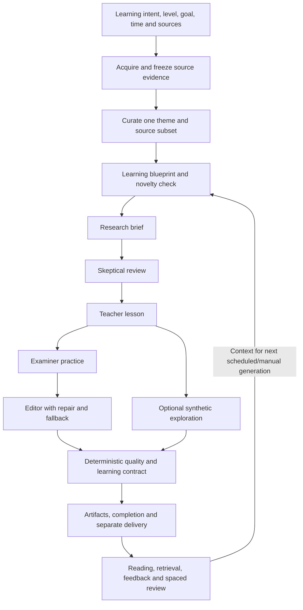

# Current content flow and evidence-backed gaps

Date: 2026-09-08. Read alongside the [overview](README.md).

## Current flow

This is a conceptual flow, not a complete concurrency or transaction diagram. Hosted preparation supplies frozen evidence to the generator; the generator also retains a direct fetch/enrich path when prepared items are absent.

## What is already strong

| Existing capability | Repository evidence | Why preserve it |
| --- | --- | --- |
| Intent before generation | `web/src/NewsletterCreate.tsx`, `web/src/newsletterForm.ts` | Collects topic, level, optional goal, time, and source preferences; setup has intent, sources, and preview steps. |
| Bounded, reproducible sources | `docs/adr/0005-source-intelligence.md`, `internal/source/service.go`, `docs/architecture.md` | Search results are candidates; resolved snapshots become frozen evidence for an Issue. |
| Lesson design before prose | `internal/dossier/generator.go`: `Generate`, `stageInstructions` | Blueprint includes objective, mechanism, example, misconception, experiment, prerequisites, and continuity. |
| Research and challenge | `stageInstructions`: researcher and skeptic | Explicitly asks for source-bounded claims, limitations, disagreement, and constraints. |
| Publication checks | `internal/dossier/quality.go`: `evaluateQuality` | Rejects malformed sections, unknown citations, missing answers, and lesson-body length violations. |
| Recovery without blind regeneration | `internal/dossier/generator.go`, `internal/dossier/stages.go` | Uses checkpoints, structured repair, and validated teacher/examiner fallbacks when editing damages the contract. |
| Existing learning loop | `internal/store/retrievals.go`, `reviews.go`, `feedback.go`, `concepts.go`; `web/src/IssueDetail.tsx` | Persists responses, self-assessments, review scheduling, feedback, and concept state. |
| Quality evaluation vocabulary | `internal/dossier/evaluation.go`, `docs/lesson-evaluation/README.md` | Already names usefulness, continuity, difficulty, unsupported claims, redundancy, and time fit. |

The proposal is to deepen these capabilities. “Add retrieval,” “add sources,” or “add a critic” would miss what already exists.

## G1. The goal can be too vague to constrain the lesson

**Observed:** `canSubmitNewsletter` requires a nonempty topic and source availability appropriate to the selected mode. The frontend permits an empty goal and defaults level to intermediate. The model receives topic, level, goal, and time through `learnerContext`.

**Implication:** “AI” and “intermediate” can be accepted without establishing what the learner wants to be able to do. The model must infer the useful outcome. This is a risk of generic content, not evidence that all topic-only lessons fail.

**Proposal:** Offer an editable, concrete outcome suggestion and one optional prerequisite check. Preserve a quick start. For a curious learner, suggest an explanatory goal rather than demanding a professional use case.

## G2. The source-selected theme constrains the later learning objective

**Observed:** `Generate` curates the source subset before generating the blueprint. The curator receives learner context, so selection is not learner-blind. Its prompt asks for a coherent theme and three to five complementary sources when available.

**Implication:** Available articles can determine the lesson's direction before an explicit task and prerequisite need have been established. Multiple relevant sources do not guarantee that the evidence teaches the next useful capability.

**Proposal:** Add a lightweight capability brief before final selection; ask whether the candidate evidence can support the task, explanation, and important boundary. Do not require a new model call until comparison shows one is needed.

## G3. Structure and citation identity are stronger than semantic checks

**Observed:** `evaluateQuality` enforces nine ordered lesson sections, minimum section substance, lesson word bounds, known citation IDs, at least `min(2, source count)` distinct lesson citations, three substantive numbered questions, an application section, and matching answer entries. Its score includes citation coverage and structural properties. `evidenceClaims` in `learning_contract.go` turns cited paragraphs into claims and validates source IDs.

**Implication:** A paragraph can cite a real source yet overstate its result. A worked-example section can have enough words yet omit the decision steps. “sourceGrounding” in the report is not an entailment test. The research/skeptic prompts help, but these deterministic checks do not prove that unsupported claims were removed.

**Proposal:** Keep mechanical checks and add an independently calibrated review of claim support, task usefulness, example correctness, and uncertainty. Avoid presenting the existing score as a learning score.

## G4. Practice has weak concept attribution and correction semantics

**Observed:** `buildLearningContract` attaches every core concept ID to every retrieval prompt. `retrievalPrompts` copies the same answer text into both `AnswerRubric` and `CorrectiveExplanation`.

**Implication:** Success on a definition question can influence concept state beyond the concept actually tested. A model answer can reveal what is correct without explaining why the learner's likely error is wrong.

**Proposal:** Specify which concept each prompt tests and separate essential answer criteria from a corrective explanation. Require a diagnostic misconception and a changed-case application question where appropriate.

## G5. Practice is initially generated from the lesson, not raw source evidence

**Observed:** The examiner's `practiceInput` includes learner context, blueprint, and teacher lesson. The editor later sees sources and practice and can revise both. Fallback paths may preserve the original examiner practice if the editor fails its contract.

**Implication:** An error introduced by the teacher can propagate into questions and answers. The later editor is a mitigating step, but the fallback quality gate is principally structural. An original question can also cease to match an edited lesson.

**Proposal:** Evaluate the exact final lesson/practice pair against evidence on every publication path. Check that the question is answerable from the lesson, the rubric is correct, and a preserved question still matches edited material.

## G6. “Available time” currently constrains the lesson body

**Observed:** `lessonWordBudgetFor` sets lesson-body bounds using 70–120 words per requested minute, with floors and caps. The estimate uses 100 words per minute. Editor instructions explicitly exclude practice and critique from that body budget. At 12 minutes, the bounds are 840–1,440 body words.

**Implication:** A structurally passing lesson can exceed a 12-minute complete session after recall, exercises, and reading supporting material. More words can also be encouraged where a smaller explanation would suffice.

**Proposal:** Define core-session time and optional depth separately. Measure actual task time in a pilot rather than replacing the current constant with another unvalidated constant.

## G7. Adaptation uses coarse evidence

**Observed:** `LoadLearnerState` loads concept aggregates, the latest feedback row, and recent claim questions. `learnerContext` includes these plus bounded historical summaries. `AssessReview` converts self-assessments into confidence values of 25, 60, or 85 and averages them into associated concept state. In-lesson reveal stores the answer/skip state and engagement events; it does not grade correctness there.

**Implication:** These are useful signals, but confidence is not independently measured mastery. The generation context does not explain the specific mistake in a learner's answer. One recent feedback row may not capture persistent difficulty or a change of goal.

**Proposal:** Keep self-report, exposure, completion, and demonstrated performance distinct. Use conservative adaptation and explain the evidence behind it. Improve question-to-concept mapping before increasing reliance on confidence.

## G8. The evaluation corpus tests judgments about sketches

**Observed:** `lesson-evaluation-v1.json` contains 12 cases, one pass/fail pair for each of six dimensions. Candidate lessons are short descriptions, including statements about length, rather than complete rendered lessons. Labels are `product_labeled`. The documented configured-model gate names an 80% agreement threshold. However, `provider_eval_test.go` also calls `t.Errorf` on each mismatched judgment, so the current Go test fails on any mismatch even if aggregate agreement exceeds 80%. This documentation/test discrepancy should be resolved when the evaluation is expanded.

**Implication:** This is useful rubric coverage, but passing it is not evidence that full generation produces useful lessons or that a learner improves. An aggregate score can also conceal a missed critical failure.

**Proposal:** Retain the corpus as a smoke test; add full artifacts, source excerpts, difficult negatives, sequence evaluation, and human adjudication. See the [evaluation plan](04-evaluation-and-roadmap.md).

## G9. Hosted feed preparation can supply summaries without linked-article enrichment

**Observed:** `internal/execution/worker.go` calls `PrepareIssue` and supplies `prepared.Items` to `Generate`. `internal/source/service.go`: `snapshotFeed` stores bounded `item.Summary` text as `feed-summary`. With prepared items present, `Generate` skips both direct fetch and `sources.Enrich`. Linked-article enrichment exists in `internal/source/acquisition.go`, but this prepared-feed path does not call it.

**Implication:** A provided feed can ground lessons in feed text rather than the linked article. Some feeds include substantial text, so `feed-summary` does not universally mean a teaser. Where the feed is short, though, the model may lack the mechanism, example details, or limitations needed for a deep lesson. Exact-page sources follow a different resolution path; this is not a claim that all hosted evidence is summary-only.

**Proposal:** Audit the actual frozen evidence first. For feeds whose text is insufficient for the intended task, resolve a bounded selection of linked articles through the existing safe acquisition path before freezing the Issue. Keep an explicit summary-only status when resolution fails. Narrow or defer unsupported lessons rather than treating article-shaped URLs as proof of article evidence. Measure sufficiency by what the task needs, not a universal word minimum.

## G10. Useful source metadata does not survive into generation

**Observed:** Snapshot metadata includes origin, role, ranking version, and quality signals. `snapshotsToSourceItems` maps only a subset into `SourceItem`, and `formatSourceBundle` presents source text and basic bibliographic/content-source information. The final `selectEvidence` sorts by quality penalty, preference, and publication date, then filters short/duplicate content; it does not enforce the role/domain distribution used during discovery.

**Implication:** Earlier diversity decisions need not survive final selection, and the curator cannot directly see persisted role, origin, or quality signals that were omitted from the generation bundle. Heuristic roles themselves still need verification; labels such as “research” are not proof of source quality.

**Proposal:** Preserve relevant provenance and caveats in the evidence packet, assess the final portfolio, and verify its fit for the learning task. Avoid rigid role quotas that demand nonexistent counterevidence or displace the strongest source.

## G11. Freshness and novelty approximate different questions

**Observed:** `snapshotsAreUsable` checks the newest fetch timestamp in the snapshot set. `HasNovelIssueEvidence` in `internal/store/source_repo.go` compares snapshot sets with the latest generated Issue. `repeatsRecentLearningSignal` compares objective/concept tokens and source overlap against the last five history entries. Evidence-led rhythm can stop generation before the blueprint if there is no new evidence.

**Implication:** One fresh item can satisfy the set-level age check, while changed source content need not add a useful learning signal. Conversely, an unchanged evidence set can support legitimate review or a new application. These gates serve useful purposes but do not fully express pedagogical novelty.

**Proposal:** Evaluate freshness per claim/item where needed; distinguish new evidence from a new capability, changed application, or justified review. Preserve the learner's evidence-led preference: offering review should be an explicit product choice, not silently changing the rhythm's meaning.

## G12. Reachability does not establish extractable teaching evidence

**Observed:** `SourceKindPDF` is declared in `internal/domain/domain.go`, but `fetchEndpoint` in `internal/source/service.go` handles feeds, HTML, and text; other kinds return an unsupported-source error. The native HTML acquisition path does not provide browser-rendered extraction.

**Implication:** A useful research PDF may be unsupported, and a reachable page that depends on client-side rendering may provide little usable text. These are different conditions from sufficient evidence that happens to be short. The current frequency is unknown.

**Proposal:** Include unsupported PDFs, empty/dynamic HTML, and extraction noise in the evidence audit. Show accurate reasons and suggest a supported equivalent source where available. Evaluate demand before proposing PDF extraction; do not introduce unrestricted browser retrieval as an automatic fallback.

## Unknowns that require samples or learner evidence

This audit does not establish the rate of irrelevant lessons, false claims, repeated concepts, source truncation problems, abandonment, or wrong answers. It also does not establish the best topic mix, reading speed, model, or lesson length. Prioritize sample review before choosing expensive fixes.

Repository references in backticks identify paths from the repository root and stable symbols where available. They are intentionally not line-number claims, because the workspace is under active development.
