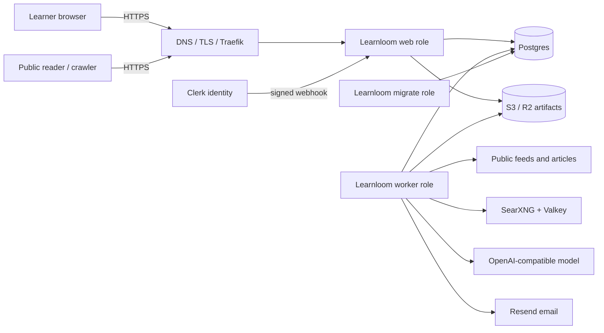
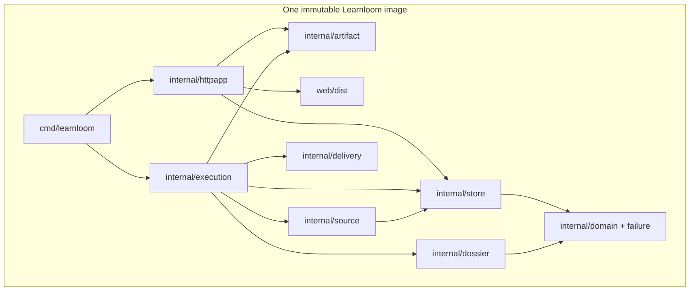
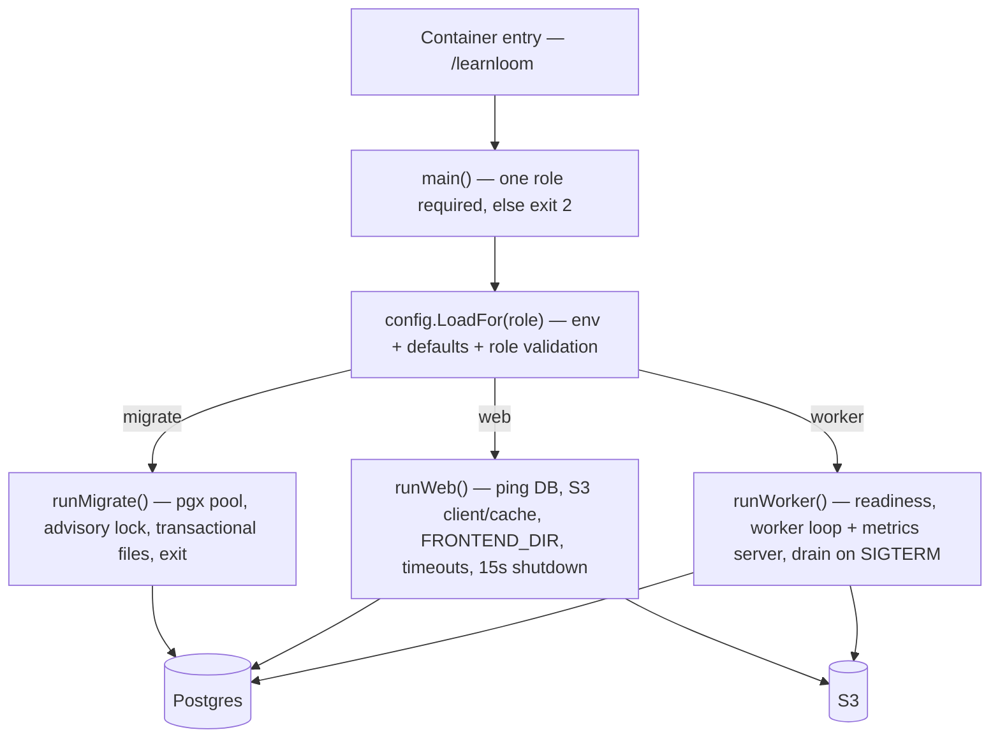

# 01 — Architecture and repository tour

## Explain Learnloom in two minutes

**Confirmed.** Learnloom is a hosted service for a learner who defines a topic,
goal, level, duration, schedule, and optionally trusted web sources. A worker
periodically gathers and freezes readable evidence, asks an OpenAI-compatible
model to build a multi-stage “Knowledge Dossier,” stores the immutable result,
and optionally emails it. The learner reads and tracks lessons in an
authenticated React application and may publish selected streams and lessons
on a username subdomain.

The browser talks synchronously to a Go web process. The web process verifies
Clerk sessions and writes to Postgres. It does not generate lessons. A separate
Go worker polls Postgres, claims work, calls sources/SearXNG/model/Resend, writes
artifacts to S3-compatible storage, and commits state transitions to Postgres.
A short-lived migrate process applies embedded SQL before web and worker start.

Evidence: `README.md`; `cmd/learnloom/main.go`; `internal/httpapp/server.go`;
`internal/execution/worker.go`; `internal/store/migrations/*.sql`.

> [!TIP] Reading this chapter
> Have two minutes? Read "Explain Learnloom in two minutes" and the three
> diagrams below. The guided repository map and startup walkthrough are depth
> for onboarding and ownership review.

## Architecture-review explanation

Learnloom is a **hosted modular monolith with process separation**. The
deployment unit is one statically linked Go executable plus a Vite-built React
bundle. The executable has three roles. Web owns HTTP policy and read/write
control surfaces; worker owns asynchronous orchestration; migrate owns schema
evolution. They share domain and persistence packages but communicate at
runtime only through Postgres and S3—not in-process calls.

Postgres is both system of record and durable queue. Issue and Delivery rows
carry status, availability, claim token, and lease expiry. Selection uses
row-level locking and `SKIP LOCKED`; transactions enforce owner scope, quotas,
unique scheduled runs, completion metadata, learning-history insertion, and
delivery creation. This avoids a separate queue but couples throughput and
availability to Postgres.

Source acquisition is a security boundary. It validates public HTTP(S) URLs,
resolves/pins public addresses, limits redirects/body sizes/content types, and
normalizes feeds or readable articles. SearXNG candidates are never direct
evidence: selected candidates still traverse native acquisition and only
persisted snapshots can be frozen to an Issue.

Generation is deliberately deep. Structured stages get strict JSON decoding,
unknown-field rejection, domain validation, and one repair attempt. Later
quality checks enforce citations, sections, answer keys, and duration-derived
word budgets. Reusable checkpoints are keyed by a fingerprint of pipeline
version, model, settings, history, and frozen evidence.

The public and private presentation models differ. The authenticated product is
a client-rendered React SPA with a small custom History API router. Public
Personal Sites and Dossiers are rendered/decorated by Go for crawlability,
canonical URLs, CSP, and tenant-safe host routing.

### System context

Text equivalent: users and crawlers enter through an external DNS/TLS/reverse
proxy boundary. Only the web role serves them. Clerk calls one webhook. Web and
worker share Postgres and object storage. Only worker reaches source sites,
search, model, and email providers. Migrate reaches only Postgres. The diagram’s
edge is supplied by Dokploy/Traefik in the recorded production shape
(`compose.dokploy.yaml → web.labels`); no edge implementation exists in the
application image.

### Container/component view

Text equivalent: `cmd/learnloom` is the composition root. HTTP does not call
source, model, or delivery. Execution coordinates their narrow interfaces.
Store is a concrete Postgres module rather than a generic repository layer.
Domain contains shared vocabulary but many business invariants correctly live
next to their transactional SQL or pipeline validation. Static React assets
are built into the container filesystem, not embedded into the Go binary.

## Boundaries and ownership

| Boundary | Owner | Communication | Failure effect |
|---|---|---|---|
| Browser ↔ web | `internal/httpapp` | synchronous HTTPS/JSON or HTML | One request fails; SPA exposes safe message |
| Web/worker ↔ Postgres | `internal/store` via pgx pool | synchronous SQL transactions | web unready; worker cycles fail; no new progress |
| Web/worker ↔ S3 | `internal/artifact` | AWS S3 API | generated detail/public reads fail; generation cannot complete |
| Worker ↔ public web | `internal/source` | bounded HTTP | issue retries/fails for insufficient evidence |
| Worker ↔ SearXNG | `internal/source/searxng.go` | JSON search | discovered mode may fail; hybrid can continue only if minimum evidence exists |
| Worker ↔ model | `internal/dossier/model.go` | Chat Completions JSON | bounded provider retries, then Issue retry/failure |
| Worker ↔ Resend | `internal/delivery/resend.go` | email API | Delivery retries or becomes `unknown`; generated artifact remains |
| Clerk ↔ web | Clerk SDK + Svix | bearer token/JWKS and signed webhook | login/provisioning fails; existing DB projection may lag |

**Data ownership:** Clerk owns identity; Learnloom’s `accounts` is a projection.
Postgres owns mutable application state. S3 owns immutable Dossier objects.
Resend owns actual delivery acceptance. Public sources own upstream content;
Learnloom preserves normalized snapshots used for a lesson.

**Failure boundaries:** generation and email are intentionally separate.
Artifact persistence occurs before transactional Issue completion, with
best-effort object deletion if the completion transaction fails
(`execution/worker.go → processIssue()`). A delivery failure never spends model
tokens again.

## Guided repository map

### `cmd/learnloom/` — composition root (**read first**, risky)

- `main.go` validates the role, loads role-specific config, installs signal
  cancellation, constructs concrete adapters, and defines HTTP shutdown/worker
  drain behavior. Everything depends on its wiring; it depends on all runtime
  modules.
- `metrics.go` exposes the worker’s independent `/healthz`, `/readyz`, and
  Prometheus-text `/metrics`.
- Risk: changing dependency construction, timeouts, or shutdown can invalidate
  reliability properties across the whole product.

### `internal/httpapp/` — hosted HTTP boundary (**security critical**)

- `server.go`: host classification dispatch, request IDs, security headers,
  panic recovery, Clerk bearer/cookie extraction, session enforcement,
  Origin/CSRF/JSON mutation policy, static serving, health and metrics.
- `control.go`: authenticated APIs for profile/site/streams/issues/progress and
  private artifact preview.
- `reading.go`: public username-site pages, Dossiers, robots, sitemap and CSP.
- `webhook.go`: signed, idempotent Clerk identity events.
- `host.go`: accepted host grammar and reserved labels.
- `response.go`: JSON problems, ETags and private cache helpers.
- `seo.go`, `authority.go`, `examples.go`: server-rendered apex discovery pages.
- Depends on store/artifact/domain and Clerk/Svix. Frontend depends on its
  implicit JSON contracts. No generated OpenAPI schema exists.
- Risk: `control.go` is 1,139 lines and combines routing, validation, payload
  projection and handler orchestration; contract drift is easy.

### `internal/store/` — transactional core (**most risky**)

- `store.go`: pgx pool with per-connection statement timeout and schema
  readiness.
- `migrate.go` + `migrations/`: embedded, advisory-locked, per-file
  transactional migrations.
- `accounts.go`: Clerk projection, site claim/settings, deletion initiation.
- `newsletters.go`: stream normalization, scheduling, source reconciliation.
- `issues.go`: dispatch, fairness, claims, attempts/checkpoints, completion,
  failure, workspace/library reads.
- `deliveries.go`: separate delivery claim state machine.
- `source_repo.go`: source catalog/endpoints/snapshots/frozen issue evidence.
- `progress.go`, `public.go`, `operations.go`: reading progress, public
  projections, rate/webhook/deletion/runtime controls.
- This is not a replaceable CRUD repository layer: it contains core invariants,
  concurrency policy, quotas, and state transitions.

### `internal/execution/` — asynchronous orchestrator (**operationally critical**)

`worker.go` recovers expired claims, dispatches schedules, claims fairly,
renews leases, loads history/evidence/checkpoints, calls generation, stores the
artifact, completes state, delivers email, deletes account objects, and cleans
operational rows. Narrow interfaces are meaningful test seams.

### `internal/source/` — source intelligence and SSRF boundary

- `http.go` owns safe HTTP transport; `acquisition.go`, `feed.go`, and
  `article.go` parse/normalize; `discovery.go` ranks candidates;
  `searxng.go` adapts JSON search; `service.go` owns the persistent catalog and
  evidence-freeze workflow; `parallel.go` bounds concurrent fetches.
- `SourceKindPDF` exists in domain/schema, but `service.go → fetchEndpoint()`
  supports feed, HTML, and text only. PDF is therefore a declared but
  unimplemented path.

### `internal/dossier/` — learning-content pipeline

`generator.go` owns stages/checkpoints/fingerprints; `model.go` owns the
OpenAI-compatible HTTP contract/retries; `quality.go` owns deterministic
content gates; `render.go` generates Markdown and escaped HTML.

### `internal/artifact/`, `delivery/`, `failure/`, `domain/`

- Artifact: S3 keys, compression, checksum, bounded decompression and in-memory
  LRU. The cache is per web/worker process, not shared.
- Delivery: concrete Resend adapter and deterministic idempotency key.
- Failure: stable learner-safe failure classification and incident IDs.
- Domain: shared data vocabulary and JSON shapes, not a complete domain layer.

### `web/` — browser product

- `main.tsx` selects marketing/legal/product based on hostname/path.
- `ProductRoot.tsx` installs Clerk only for the hosted product.
- `HostedApp.tsx` handles auth routes, token setup, profile/CSRF bootstrap.
- `App.tsx` implements a small History API router and lazy detail/create pages.
- `useWorkspace.ts`, `useLibrary.ts`, `api.ts`, `learningState.ts` are the
  client data/state layer.
- Page components contain view-specific mutations; no external state library
  or schema validator exists. CSS is split by product era/surface rather than a
  formal design system.
- `DemoHostedApp.tsx`, `demoData.ts`, and `VITE_DEMO_MODE` are development-only
  demo code. README’s “no offline demo” means no production backend demo; the
  browser dev demo still exists. This is a documentation ambiguity.

### Infrastructure and ancillary content

- `Dockerfile`: reproducible multi-stage frontend/Go build, distroless nonroot
  runtime.
- `compose.yaml`: local Postgres, MinIO, optional SearXNG/Valkey, roles.
- `compose.dokploy.yaml`: current recorded VM production topology using local
  Postgres, R2, SearXNG/Valkey, and external Dokploy network.
- `.github/workflows/ci.yml`: build/lint/unit/integration/race/vulnerability/
  audit/container checks; no deployment job.
- `infra/searxng/`: pinned custom search image/settings.
- `launch-video/`: independent Remotion marketing asset project; not a runtime
  dependency of Learnloom.
- `docs/backend-architecture-guide.html` and UX/SEO documents are explanatory
  or planning artifacts, not runtime inputs.

### Generated, vendor, dead-looking, and unclear items

- `package-lock.json`, `launch-video/remotion/package-lock.json`, built
  `web/dist` (ignored), and Go module sums are generated dependency metadata.
- `node_modules` is present locally but not tracked and was excluded.
- No vendored application code or generated API client was found.
- `SourceKindPDF` is dead-looking/unimplemented as noted above.
- `SourceAcquirer.Fetch/Enrich` remains as a fallback interface in the Dossier
  generator, although production always supplies `PreparedItems` through
  source intelligence. It is useful in tests/legacy shape but is not the
  production path (`execution/worker.go → processIssue()`).
- Historical branches contain SQLite/Node/self-hosted implementations; they
  are not in the current tree and must not be treated as live alternatives.

## Runtime entry points and startup

### Common start

1. Container entry point is `/learnloom`; default command is `web`
   (`Dockerfile → ENTRYPOINT, CMD`).
2. `main()` accepts exactly one of `web|worker|migrate`; invalid usage exits 2.
3. `config.LoadFor(role)` reads environment, applies defaults, and validates
   role requirements before any adapter is created.
4. JSON `slog` to stdout is configured and SIGINT/SIGTERM create the root
   cancellation context.

### Migrate role

1. Open pgx pool.
2. Acquire a dedicated connection and Postgres advisory lock.
3. Create `schema_migrations` if absent.
4. Read embedded SQL in filename order; apply each missing file in its own
   transaction; insert version; commit.
5. Close pool and exit. Any failure exits nonzero.

Evidence: `cmd/learnloom/main.go → runMigrate()`;
`internal/store/migrate.go → Migrate()`.

### Web role

1. Open Postgres and ping it.
2. Construct S3 client/cache.
3. require `FRONTEND_DIR/index.html`.
4. Construct `httpapp.Server`, including Clerk middleware.
5. Start `http.Server` with 10s header, 30s read, 2m write, 60s idle timeouts
   and 32 KiB max headers.
6. On cancellation, allow 15s for `Server.Shutdown`; deferred pool close runs.

Web does not run migrations automatically and does not compare schema version
in `runWeb`; store readiness checks current schema in `Store.Ready()`.

### Worker role

1. Open/ping Postgres and construct S3.
2. Construct OpenAI model, safe acquisition, Dossier generator, source service
   and optional SearXNG searcher, Resend adapter, then execution worker.
3. Verify model and storage/database readiness before accepting work.
4. Start worker loop and a separate metrics HTTP server concurrently.
5. On signal, mark worker draining (readiness becomes 503), stop claiming,
   continue current claim renewal, and wait up to `IssueTimeout + 1 minute`.
6. If deadline expires, cancel execution; `processIssue()` releases a
   drain-cancelled claim without consuming a generation attempt. Shut metrics
   down with a 15s timeout.

Evidence: `cmd/learnloom/main.go → runWorker()`; `metrics.go`;
`internal/execution/worker.go → Run(), BeginDrain(), processIssue()`.

### Frontend/test/dev starts

- Vite entry is `web/src/main.tsx`; `web/index.html` supplies `#root`.
- `npm run dev` starts Vite only. `npm run demo` sets a development-only demo.
- `docker compose up --build` starts database/object store, runs migrate once,
  then web/worker. SearXNG requires the `discovery` profile locally even though
  `.env.example` may enable discovery; see chapter 07.
- Vitest starts through `web/vite.config.ts`; Go tests use package-native
  entry points. Postgres/S3 integration tests skip without their `TEST_*` envs.
