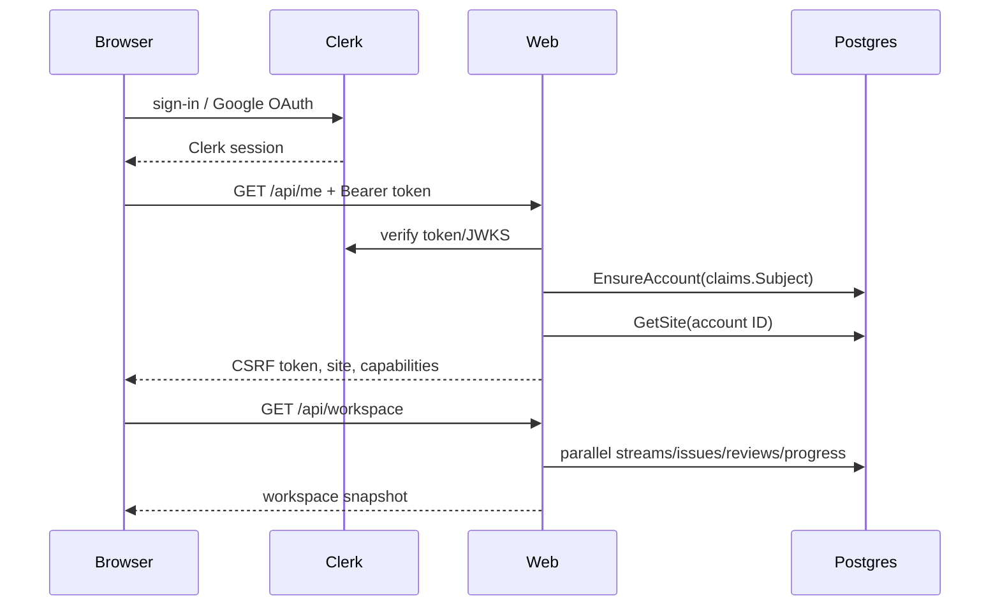
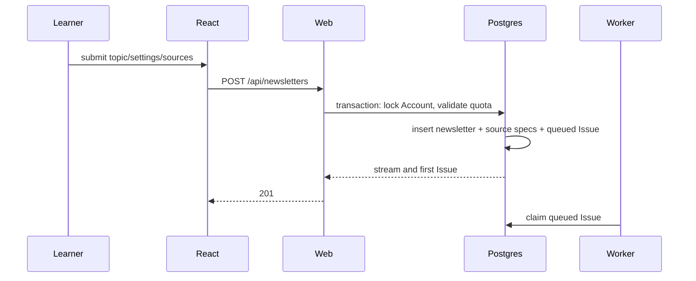

# 02 — User journeys, frontend/backend architecture, and API contracts

## Frontend architecture

**Confirmed.** The authenticated product is a React 19 client-rendered SPA
built by Vite 8. There is no SSR framework, React Server Components, Redux,
React Query, form library, or runtime schema library (`package.json`;
`web/src/main.tsx`).

Routing is a custom History API listener in `web/src/App.tsx`: a document click
handler intercepts same-origin anchors, pushes history, and matches pathname
with strings/regular expressions. The Go server returns the same SPA index for
unknown GET paths on the app host. Detail and creation pages are lazy-loaded.

State has three layers:

- Clerk React owns identity/session state (`ProductRoot.tsx`, `HostedApp.tsx`).
- module-level variables in `useWorkspace.ts` deduplicate and cache the
  workspace for five minutes; Library is hook-local with abort/version guards.
- `learningState.ts` stores optimistic reading/review state in
  `localStorage["learnloom.learning-state.v1"]`, then server progress projections
  monotonically hydrate it. Durable completion lives in Postgres; review state
  is browser-only.

`api.ts` is the only request wrapper. It gets a Clerk token for every call,
adds `Authorization`, and adds JSON content type plus session-derived CSRF for
mutations. It parses problem JSON but throws only the safe `message`, losing
machine-readable codes and status. Frontend types in `types.ts` are deliberately
loose (`[key: string]: any`) and duplicated from Go payloads; no code generation
or runtime validation protects contract drift.

Forms are controlled React state with local normalization
(`newsletterForm.ts`, `NewsletterCreate.tsx`, `PublishingPage.tsx`) followed by
backend validation. Loading/error states are page-specific; there is no React
error boundary. `CalmLoader` is reused for asynchronous route/auth states.
Styling is global CSS (`entry.css`, `styles.css`, `redesign.css`, surface-specific
files) with reusable class conventions but no token/component package.

Static assets are content-hashed by Vite and served for one year by Go. Favicons
revalidate every five minutes. Marketing hero/backdrop images are AVIF/WebP and
preload/prefetch respects viewport and Save-Data/slow connections
(`web/src/main.tsx`; `httpapp/server.go → serveStatic()`).

Accessibility evidence includes semantic headings/navigation, `aria-label`,
alert roles, skip links in public reading, keyboard-native links/buttons, and
reduced loading transitions. **Unknown:** no automated axe/screen-reader/
keyboard suite establishes conformance.

Analytics is limited to CLS/INP/LCP. `performance.ts` strips resource IDs from
page dimensions and posts values to the web role, which logs them; there is no
analytics vendor or durable metrics store.

### Coupling and leaked logic

- **Confirmed:** selection of “primary lesson,” local completion merging, and
  review status live in UI utilities. This is presentation policy, but review
  completion is browser-only and can diverge across devices
  (`TodayPage.tsx`, `learningState.ts`).
- `NewsletterCreate.tsx` and `NewsletterDetail.tsx` know backend action URLs
  and payload details. `types.ts` optional/`any` shapes weaken refactoring.
- The five-minute module cache has no account key. A full Clerk sign-out
  redirects, so ordinary use resets the JavaScript realm; an in-realm account
  switch would risk showing stale data until invalidated.

## Backend architecture

The backend uses the Go standard `net/http`, not a web framework. `Server`
performs host policy and authentication before `control.go` manually dispatches
paths. There is no separate controller/service/repository stack:

- handlers validate transport input and call store operations;
- store methods combine authorization, domain transitions, and SQL;
- execution is a genuine use-case/orchestration layer for async work;
- source and Dossier are deep domain-capability modules.

Dependencies are constructed explicitly in `cmd/learnloom/main.go`, with
interfaces only around worker/test seams. Validation occurs in config loading,
HTTP decode, store normalization, DB constraints, model contract parsing, and
quality gates. Errors are translated by `response.go → writeStoreError()` or
safe failure projections. Transactions are opened inside store methods at
invariant boundaries.

Concurrency is bounded at worker/global, account, model, and source-fetch
levels. Claims use tokens/leases; model HTTP and source HTTP have timeouts;
web requests have server timeouts. Rate limiting is durable Postgres buckets,
but only username check/claim, stream creation, and manual generation invoke
it (`control.go → allowAction()`).

## Journey 1: sign in and bootstrap



Text trace:

1. `HostedApp.tsx` selects sign-in/sign-up/SSO callback or authenticated gate.
   Clerk UI hooks execute password/Google flows; Learnloom never sees passwords.
2. On a signed-in session, `configureAPI(getToken)` is set, workspace preload
   begins, and `GET /api/me` is requested.
3. `server.go → authenticated` verifies authorized party and session token.
   `handleAuthenticated()` requires subject and session ID.
4. `store.EnsureAccount()` returns/creates the Clerk subject projection and
   refuses suspended/deleted accounts.
5. The web role HMACs the session ID with `CSRF_SECRET`; the raw session ID is
   not returned. Profile includes site and source-discovery capability.
6. The workspace endpoint reads four projections concurrently and returns a
   private ETag-capable response. Client hydrates issues with their stream and
   merges durable progress.
7. Failure paths: Clerk load failure shows auth error; missing token throws
   session-expired; invalid auth is 401; unavailable Account is 403; DB failure
   is request-ID-correlated 500.

Tests: `HostedApp.test.tsx`, `api.test.ts`,
`httpapp/control_test.go → TestClerkSessionTokenSupportsAPIsAndPageNavigations`,
`store/accounts_test.go`.

## Journey 2: create a learning stream and first lesson



`NewsletterCreate.tsx` builds the request through `newsletterForm.ts`. Mutating
credentials are bearer + exact Origin + CSRF + JSON. The handler rate-limits 20
creates/account+address/hour and parses schedule. `CreateNewsletter()` applies
topic-only defaults where allowed, validates timezone/source mode/URLs/limits,
locks the Account, checks status and max streams, allocates an owner-unique
slug, inserts stream and provided `source_specs`, checks daily Issue quota, and
inserts the first manual Issue—all in one transaction. A quota failure rolls
everything back (integration test
`TestCreateNewsletterDailyQuotaRollsBackIntegration`).

UI navigates to the new stream and invalidates workspace cache. No work happens
inside the request. The worker will claim it. A manual Issue remains eligible
even if the stream is later inactive (`ClaimNextIssue()` condition
`n.active OR i.trigger = 'manual'`).

## Journey 3: scheduled generation

```mermaid
sequenceDiagram
  participant K as Worker
  participant P as Postgres
  participant S as Sources / SearXNG
  participant M as Model
  participant O as S3
  participant E as Resend
  K->>P: recover expired claims; dispatch due streams
  K->>P: fair SKIP LOCKED claim + attempt row
  K->>P: load history
  K->>S: refresh catalog / discover candidates
  S-->>K: readable evidence
  K->>P: snapshots + frozen issue_sources
  K->>M: validated multi-stage generation
  K->>P: stage records/checkpoints
  K->>O: put immutable compressed artifact
  K->>P: complete Issue + history + optional delivery
  K->>P: claim delivery
  K->>E: idempotent email
  K->>P: record delivered / failed / unknown
```

1. Each cycle recovers expired Issue claims (requeue with a separate claim-loss
   budget) and Delivery claims (mark unknown), then dispatches up to 100 due
   streams. Unique `(newsletter_id, scheduled_local_date)` prevents duplicate
   daily scheduled Issues. `NextOccurrence()` handles IANA time zones/DST.
2. Claim selection checks global/account daily limits and per-account
   concurrency, ranks one candidate per account, orders least-recent account
   first, locks with `SKIP LOCKED`, increments attempt, and creates an append-only
   `issue_attempts` row.
3. A renewal goroutine extends the lease every min(claim/3, 30s). Transient DB
   errors are tolerated until current expiry; lost lease cancels work.
4. Source service reuses frozen sources if present. Otherwise it refreshes
   active catalog concurrently, optionally discovers candidates, persists
   endpoints/snapshots, enforces minimum evidence, and atomically freezes the
   ordered set. Search snippets are never evidence.
5. The generation fingerprint gates checkpoint reuse. Stages are curator →
   blueprint → researcher → skeptic → teacher → examiner plus optional parallel
   exploration → editor. Structured stages receive one contract-repair retry.
   A deterministic quality gate can preserve validated teacher/examiner output
   if editor drift affects only a later contract.
6. Artifact `Put()` validates opaque key components, serializes canonical JSON,
   compresses, checksums, uploads, and caches. Then `CompleteIssue()` atomically
   verifies claim, marks generated, inserts learning history, bounds old
   history, removes checkpoints, completes attempt, and creates delivery only
   when email remains enabled and an address exists.
7. If DB completion fails after upload, worker deletes the new object. If
   delete also fails it can leave an orphan, but never a generated row pointing
   to an uncommitted key.
8. Email is reconstructed from the stored artifact. Resend idempotency key is
   `learnloom/{issueID}/{generationID}`. Network/cancellation/accepted-but-
   uncommitted outcomes become `unknown` and are never automatic retries.

Key tests: `source/service_test.go`, `dossier/generator_test.go`,
`dossier/quality_test.go`, `execution/worker_test.go`,
`store/integration_test.go`.

## Journey 4: read and complete a lesson

`IssueDetail.tsx` gets `/api/issues/{id}`. The owner-scoped query requires a
generated Issue and S3 key. The response is private, ETagged for five minutes,
and includes Dossier plus projected sources. The component maps stored Dossier
sections into its reading UI (`dossierView.ts`).

Scrolling/interaction posts 1–99 percent to `/progress`; completion posts
`/complete`, which upserts 100 percent and `completed_at`. Both SQL operations
join the Issue through Newsletter owner and require `generated`. Local storage
updates immediately and server snapshots later hydrate monotonically. Errors
leave local optimistic state potentially ahead until the next sync.

The separate `/issues/{id}` endpoint renders private stored HTML with restrictive
CSP; it is an authenticated preview, not the React reader.

## Journey 5: publish a Personal Site

1. `PublishingPage.tsx` checks `/api/usernames/{label}` (30/minute), then claims
   one site (5/hour). Store normalizes grammar/reserved names and uses unique
   constraints to settle races.
2. Settings change visibility/display/description/search indexing.
   `search_indexing` can be true only with public visibility in handler/store
   validation and DB check constraint.
3. Per-stream `siteVisible` and per-Issue publication state further filter
   public SQL. Public visibility is therefore a three-gate policy: public site,
   visible stream, published generated Issue.
4. `<username>.<root>` is classified before lookup. Go returns public home,
   topic archive, canonical Dossier, robots and sitemap. Public Dossier URL is
   `/d/{publicID}/{slug}`; wrong/missing slug permanently redirects.
5. Model text is already escaped by renderer; public decoration adds canonical,
   OpenGraph and Article JSON-LD. CSP denies scripts and frames. Search indexing
   is opt-in and also controls robots/sitemap/index headers.

## Journey 6: Clerk account lifecycle and deletion

Clerk posts a Svix-signed webhook. The web role bounds body size, verifies
signature, requires `svix-id`, and inserts an idempotency record. Created/updated
events project verified primary email and active/suspended status. Deleted
events mark Account deleted. `accounts.go → stopAccountWork()` cancels queued
work/delivery, disables streams/site, and enqueues account artifact deletion.
Worker claims deletion and deletes the Account prefix in S3 before completing
the queue row. Account database rows are retained with deleted status rather
than immediately hard-deleted.

## HTTP API catalogue

All `/api/*` and authenticated `/issues/*` routes require a valid Clerk session.
All mutations additionally require exact `Origin == LEARNLOOM_APP_ORIGIN`,
session-HMAC `X-CSRF-Token`, and `application/json`. JSON bodies are bounded by
`MAX_REQUEST_BODY_BYTES`; unknown JSON fields and trailing values are rejected
by `response.go → decodeJSON()`.

| Method/path | Purpose and request | Response / effects | Caller |
|---|---|---|---|
| `GET /api/me` | bootstrap | 200 CSRF, primary email, site, capabilities; ensure Account | `HostedApp` |
| `GET /api/usernames/{name}` | availability; 30/min | 200 username/available | `PublishingPage` |
| `POST /api/me/site/claim` | `{username,displayName}`; 5/hour | 201 site; inserts one site | `PublishingPage` |
| `POST /api/me/site/settings` | visibility + optional display/description/indexing | 200 site; owner update | `PublishingPage` |
| `GET /api/workspace` | initial composite | 200 summary/streams/24 issues/cursor/8 reviews/progress; private ETag | workspace hook |
| `GET /api/library` | `q`≤120, filter, limit 1–100, cursor | server-side generated lesson search/filter/page | library hook |
| `GET /api/issues` | limit/cursor | older owner issues | workspace hook |
| `GET /api/newsletters` | list streams | 200 summaries | legacy/direct |
| `POST /api/newsletters` | stream input; 20/hour | 201 stream + first queued Issue | create page |
| `GET /api/newsletters/{id}` | aggregate detail | stream, ≤100 issues, all progress/sidebar/source catalog | detail page |
| `PUT /api/newsletters/{id}` | full stream input | 200 reconciled stream/catalog | detail page |
| `POST .../{id}/run` | empty JSON | 202 queued manual Issue; 10/hour and daily quota | detail page |
| `POST .../{id}/active` | `{active}` | 200; schedule toggle | detail page |
| `POST .../{id}/delivery` | `{enabled}` | 200; requires verified email when enabling | detail page |
| `POST .../{id}/content` | `{aiExplorationEnabled}` | 200 | detail page |
| `POST .../{id}/site` | `{visible}` | 200 | publishing/detail |
| `GET /api/issues/{id}` | generated lesson JSON | private ETag; S3 read; 409 before generation, 410 absent artifact | issue page |
| `POST .../{id}/retry-generation` | empty JSON | 202; only eligible failed Issue | detail |
| `POST .../{id}/publication` | `{state: published|hidden}` | 200 | detail/publishing |
| `POST .../{id}/retry-delivery` | empty JSON | 202; explicit retry | detail |
| `POST .../{id}/progress` | `{progress:1..99}` | durable progress | issue page |
| `POST .../{id}/complete` | empty JSON | durable 100/completed | issue page |
| `GET /issues/{id}` | authenticated HTML preview | private no-store HTML + CSP | direct preview |
| `POST /api/performance/vitals` | CLS/INP/LCP value/rating/nav/page | 204; logs only | `performance.ts` |
| `POST /webhooks/clerk` | signed Clerk event, no session/CSRF | 204 idempotent projection; 400 invalid signature | Clerk |

Common error contract is RFC-7807-like JSON with `code` and safe `message`.
Expected mappings include 400 validation, 401 auth, 403 ownership/account/CSRF,
404 hidden resource, 409 conflict/state, 413 body, 415 media type, 429 durable
rate limit, 500 internal, and 503 readiness. **Weak contract:** this catalogue
is reconstructed; the project has no OpenAPI file or full route-level contract
tests.

Public GET/HEAD contracts are apex `/`, `/privacy`, `/terms`, `/examples`,
SEO/authority paths catalogued in `seo.go`/`authority.go`, and Personal Site
`/`, `/topics/{slug}`, `/d/{publicID}/{slug}`, `/robots.txt`, `/sitemap.xml`.
Health/metrics exist at app host `/healthz|readyz|metrics` and worker metrics
port equivalents. There are no webhooks besides Clerk, no WebSocket/SSE, and no
application-level event bus or file-upload API.
