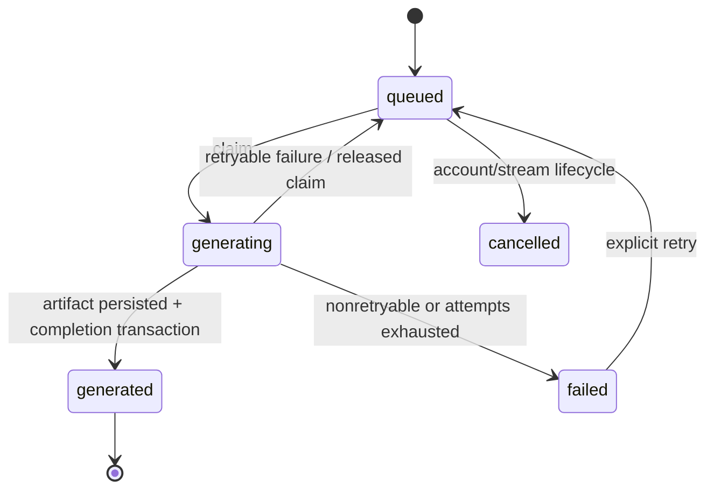
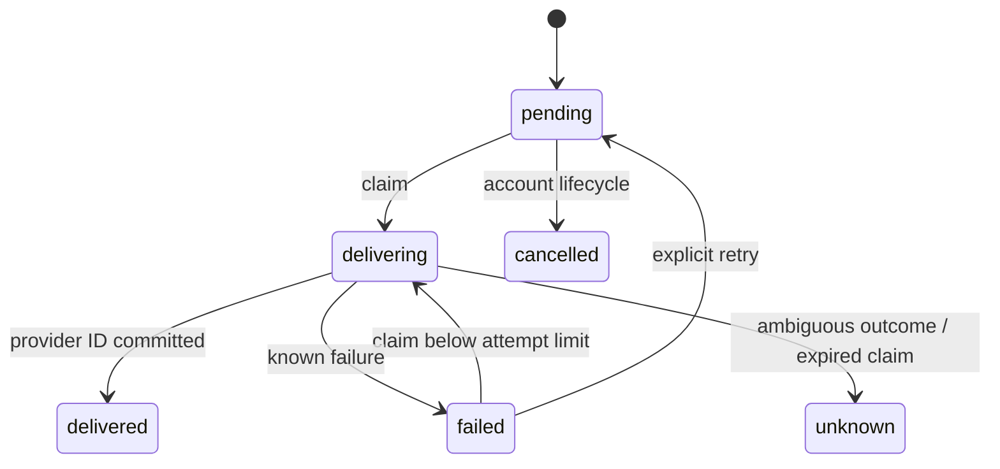
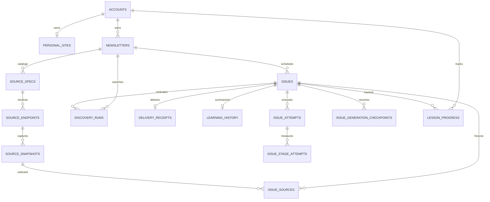

# 03 — Domain model and data architecture

## Domain glossary

| Concept | Meaning, ownership, lifecycle |
|---|---|
| Account | Learnloom projection of a Clerk user. Active/suspended/deleted. Owns streams and one optional Personal Site. Clerk subject is unique. |
| Personal Site | Username subdomain and publishing settings. One per Account; username globally unique; private/public; indexing only when public. |
| Newsletter / learning stream | Long-lived learning intent: topic, level, goal, duration, source policy, local schedule, email/content/publication options. “Newsletter” is legacy/internal naming; UI says stream. |
| Issue / lesson | One scheduled or manual generation unit. Carries queue/claim/current failure/publication/artifact projection. Public UUID is separate from internal UUID. |
| Source Spec | Persistent policy for a provided/discovered source. Candidate/active/unhealthy/rejected/disabled. |
| Source Endpoint | Resolved fetch target plus kind, HTTP validators, health and refresh history. |
| Source Snapshot | Immutable normalized item content and checksum from one fetch. |
| Issue Source | Ordered many-to-many freeze between an Issue and exact snapshots. |
| Discovery Run | Operational record of why/how source search ran and candidate outcomes. |
| Dossier | Versioned generated lesson: curation, blueprint, lesson, critique, practice, optional exploration, quality and sources. |
| Artifact | Immutable canonical Dossier JSON plus Markdown/HTML stored compressed in S3. |
| Learning History | Compact per-Issue continuity summary fed into future generation. |
| Lesson Progress | Per-account per-Issue percentage/completion projection. |
| Issue Attempt / Stage Attempt | Append-only operational evidence for a claim and its model stages. |
| Generation Checkpoint | Valid stage output reusable only with matching generation fingerprint. |
| Delivery Receipt | Separate email state/claim; one per Issue. |

## State machines and invariants

Text equivalent: only queued Issues can be claimed; generating must have a
token and expiry; generated must have generation ID and artifact key. A
generation attempt can requeue or terminally fail. Account lifecycle can cancel
future work. Explicit retry clears failure and requeues. The database checks
only some edges; transition SQL supplies the rest
(`001_initial.sql → issues CHECK`; `issues.go`).

`unknown` is terminal until a human chooses a future reconciliation strategy;
current API does not permit retrying unknown (store transition is limited).
This avoids duplicate email when provider acceptance is unknowable.

Other invariants:

- one scheduled Issue per stream/local date (partial unique index);
- one delivery, learning-history row, and progress row per relevant Issue;
- frozen source position is unique within an Issue;
- source snapshot identity is unique by endpoint + item key + content checksum,
  retaining changed versions;
- checkpoints are unique by Issue + fingerprint + stage;
- lesson progress is 0–100; handlers only write 1–99 or 100;
- public reads require public site + visible stream + generated/published Issue;
- all control mutations scope through the Account owner in SQL.

## Entity relationship

Text equivalent: Accounts own site/streams; streams own issues and source
catalog. Endpoints yield immutable snapshots, frozen to Issues via join rows.
Issues own operational attempts/checkpoints and optional delivery/history/
progress. Discovery belongs to a stream and may be associated with an Issue.
Webhook/rate/runtime/deletion tables are operational roots rather than domain
children.

## Complete schema reference

Database is PostgreSQL 17 in both Compose files. Application compatibility is
pgx v5; no explicit minimum server version is asserted in code.

| Table | Purpose, principal writers/readers, key constraints/indexes |
|---|---|
| `accounts` | identity projection; webhooks/EnsureAccount write, all owner flows read. UUID PK, unique Clerk ID, status check. Deleted rows retained. |
| `personal_sites` | publishing identity/settings. unique owner and username, FK cascade, lowercase check; migration 005 adds public-only indexing. |
| `newsletters` | stream settings/schedule. owner FK cascade, duration/time checks, JSON source compatibility column, unique owner slug; owner-created and due partial indexes. |
| `issues` | queue/current projection. stream FK cascade, status/trigger/publication checks, claim/generated checks, unique public ID and scheduled local day; claim/expiry/history indexes. |
| `delivery_receipts` | email queue. Issue PK/FK cascade, status/claim check, claim/expiry indexes. |
| `learning_history` | generation continuity JSON. stream+date+Issue PK, unique Issue, JSON object, recent index. |
| `webhook_events` | Clerk idempotency and outcome. External text ID PK; old successful rows cleaned after 30 days. |
| `account_deletion_queue` | durable S3 deletion claim and retry. Account ID intentionally has no FK so work can outlive relational deletion, though current Accounts are retained. |
| `request_rate_buckets` | durable fixed-window counts by compound key/action/window; old rows cleaned. |
| `runtime_controls` | singleton generation pause. Boolean singleton PK/check; manually operated. |
| `source_specs` | source policy/catalog. stream cascade; enums/checks; stream/state index and unique non-null canonical per stream. |
| `source_endpoints` | fetch resolution/validators/health. spec cascade, unique spec, health check. |
| `source_snapshots` | immutable normalized evidence. endpoint cascade; unique endpoint/item/content SHA; recent lookup index. |
| `issue_sources` | exact ordered frozen evidence. Issue cascade, snapshot no-delete action (default restrict), composite PK and unique position. |
| `discovery_runs` | search audit. stream cascade, Issue set-null; reason/state checks. |
| `issue_attempts` | append-only claim execution. Issue cascade, unique Issue+attempt, context/model/pipeline/failure/incident data. |
| `issue_stage_attempts` | per-attempt stage duration/outcome. attempt cascade, nonnegative duration. |
| `issue_generation_checkpoints` | resumable stage output. Issue cascade; composite PK fingerprint/stage and Issue index. |
| `lesson_progress` | durable owner progress. account/Issue cascades, composite PK, 0–100, recent index. |
| `schema_migrations` | created by migrator; applied version ledger. |

There are no views, triggers, custom sequences, generated columns, row-level
security policies, or soft-delete flags beyond Account status/deleted_at.
UUIDs are mostly application-generated; claim recovery uses `gen_random_uuid()`,
so PostgreSQL’s UUID function must be available. No explicit extension creation
is present—modern PostgreSQL supplies it, but older deployment assumptions
would need checking.

## Migration evolution and implications

1. `001_initial.sql` created the hosted core, public sites, queue/claims,
   delivery, history, webhook deletion/rate/runtime controls.
2. `002_source_intelligence.sql` added source modes, normalized source catalog,
   immutable snapshots/freeze and discovery audit. The original `newsletters.sources`
   JSON remains as compatibility/projection data, creating intentional
   duplication reconciled by `newsletters.go`.
3. `003_issue_failure_history.sql` separated safe/current failure projection
   from append-only attempt/stage evidence and added checkpoints. This reflects
   production recovery/diagnostic hardening.
4. `004_lesson_progress.sql` moved completion from browser-only state into
   durable cross-device data.
5. `005_site_search_indexing.sql` separated public visibility from explicit
   crawler indexing consent.

Migrations are forward-only. There are no down migrations or automated
pre-deployment compatibility checks. Each file is transactional and migration
processes serialize via advisory lock (`migrate.go → Migrate()`).

## Transaction and query behavior

Important atomic boundaries:

- stream + source specs + first Issue creation;
- full stream update and source-spec reconciliation;
- due schedule dispatch plus next-run advancement;
- Issue claim plus attempt insertion;
- Issue completion plus history, checkpoint cleanup, attempt close and optional
  delivery creation;
- Account identity deletion plus stopping work/deletion enqueue;
- site claim and owner quota checks.

Default pgx transaction isolation is Read Committed. Claim selection explicitly
uses Read Committed and row locks. Fairness aggregates account activity on each
claim; at high row counts that query is likely a first DB bottleneck.

Workspace reads run four queries concurrently. Newsletter lists aggregate Issue
and delivery counts in SQL. Library search uses server-side query/filter/
keyset pagination. Public pages cap lists (24 home, 100 topic, 49,000 sitemap).
No ORM exists, so conventional ORM N+1 behavior is absent. Public home performs
separate newsletter and Issue queries; detail aggregates several independent
queries by design.

Connection configuration: pgxpool max 20/min 2 by default, per-connection
`statement_timeout` 15s, simple Ping readiness (`store/store.go → Open()`).
Every web/worker replica owns its own pool, so total database connections equal
replicas × configured pool.

## Integrity, retention, and recovery

- Most owner data cascades on physical Account deletion, but current deletion
  marks status and retains row; application data therefore remains until an
  external/manual hard-delete policy is applied. Artifact deletion is queued.
- Operational webhook/rate rows older than 30 days are cleaned hourly.
  Checkpoints are removed on successful completion; attempt history persists
  with Issue.
- No audit log records ordinary settings/publication changes.
- Primary email, Clerk user ID, source content, learning intent/history and
  generated lessons are sensitive/personal data. They are stored plaintext at
  application level; encryption depends on Postgres/S3 infrastructure.
- Artifact and DB are a coordinated recovery set, but there is no distributed
  transaction. Backup instructions require both; restore must never blindly
  replay delivered/unknown email.
- No repository-defined backup job, retention schedule, restore automation, or
  verified RPO/RTO exists. These are operator responsibilities.

## Risks in the data model

1. `newsletters.sources` JSON and normalized `source_specs` can diverge if a
   future write bypasses `CreateNewsletter`/`UpdateNewsletter`.
2. Several valid state transitions are application-SQL conventions rather than
   DB-enforced transition constraints.
3. No DB RLS means a missed owner predicate is a tenant leak. Current reviewed
   control queries include owner scope, but this remains a high-consequence
   review obligation.
4. Account soft deletion retains personal DB content with no declared purge
   deadline; only object artifacts are durably removed.
5. Object orphan cleanup is not implemented. A failed post-upload DB commit
   attempts delete, but outages can strand objects.
