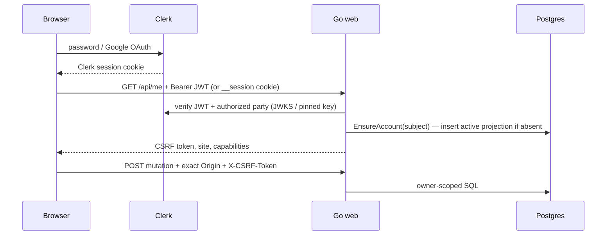
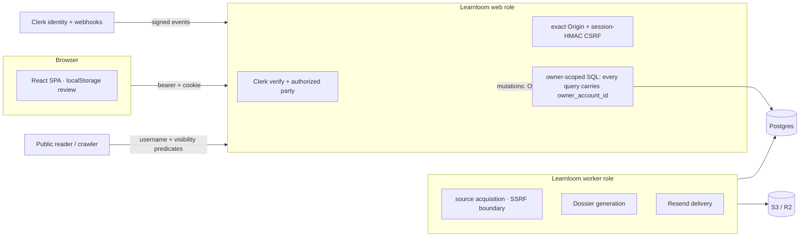

# 04 — Authentication, authorization, security, and configuration

## Authentication end to end

**Identity provider:** Clerk. React is initialized with the build-time
publishable key (`ProductRoot.tsx`). Password/Google flows execute through Clerk
hooks in `AuthPage.tsx`; OAuth returns through `/sso-callback`.

**Session format/storage:** Clerk owns browser session persistence. `api.ts`
asks `useAuth().getToken()` and sends a bearer JWT. For page/API compatibility,
the Go extractor also accepts Clerk’s `__session` cookie
(`httpapp/server.go → clerkSessionToken()`). The application does not implement
refresh; Clerk SDK does. Logout calls `clerk.signOut()` then redirects to
`/sign-in`.

**Verification:** official Clerk Go middleware verifies token and authorized
party equals app origin. It normally retrieves rotating keys from Clerk; an
optional PEM `CLERK_JWT_KEY` pins/overrides verification. Claims must contain
subject and session ID.

**Provisioning/synchronization:** first authenticated request can insert an
active Account projection with no email (`store.EnsureAccount()`). Signed Clerk
webhooks later project verified primary email and active/suspended/deleted
status. Event timestamps prevent stale webhook overwrite; deleted is terminal.

**CSRF:** bearer authentication alone is accepted for reads. Mutations require:
exact Origin, HMAC-SHA256 of `"learnloom-csrf\0"+sessionID` under a ≥32-character
secret, and JSON. The token is returned by `/api/me` and held only in JS memory.

## Authorization model

There are no roles beyond Account status. Authorization is tenant ownership:

- middleware maps verified Clerk subject to exactly one internal Account;
- every authenticated store read/write takes Account ID and constrains
  `owner_account_id`, directly or through Newsletter joins;
- missing/non-owned resources generally return 404, limiting enumeration;
- public reads use username plus active/public/visible/published predicates;
- worker claims only work whose Account remains active.

**Confirmed review result:** no authenticated control route was found that
relies solely on frontend authorization. `issuePreview`, `issueDetail`,
progress, publication/retries, Newsletter settings, source catalog, site, and
workspace all reach owner-scoped SQL.

**Structural risk:** PostgreSQL row-level security is absent, so tenant safety
is a convention enforced in every query. Any future unscoped SQL is high
severity even if the handler is authenticated.

Service-to-service boundaries: Clerk webhook uses Svix signature; model/Resend/
S3 use provider credentials; SearXNG has no application-level auth on its
private Compose network; web and worker authenticate to Postgres/S3 through
injected credentials.

## Security review findings

Severity reflects impact; confidence reflects repository evidence. “Possible”
items require runtime/infrastructure validation and are not claimed exploitable.

> [!DANGER] Release blocker (confirmed)
> `currentSchemaVersion = 4` but `005_site_search_indexing.sql` exists. After
> migrate applies version 5, `Store.Ready()` rejects it — the current web/worker
> image cannot become ready or start. TD-001; fix before any deployment.

| Severity | Confidence | Finding and evidence | Recommendation |
|---|---|---|---|
| **Critical reliability, not security** | Confirmed | `internal/store/store.go → currentSchemaVersion = 4`, but `migrations/005_site_search_indexing.sql` exists. After migrate applies version 5, `Store.Ready()` rejects it; current web/worker cannot become ready/start. CI does not call `Ready()` after migrations. | Set expected version to 5 with regression test that applies all embedded migrations then checks readiness. This handbook does not change production code. |
| High | Confirmed design risk | Tenant isolation has no RLS; it depends on every SQL owner predicate (`internal/store/*`). | Keep query review mandatory; add cross-tenant route integration tests; consider defense-in-depth RLS only via ADR. |
| Medium | Confirmed | App `/metrics` is unauthenticated on the public app host and Dokploy routes all app paths. It exposes only aggregate counters today (`server.go → handleMetrics()`), but increases reconnaissance surface. | Restrict metrics at reverse proxy/private network or separate listener. |
| Medium | Confirmed | Worker metrics port is exposed only internally in Dokploy, but local Compose binds `127.0.0.1:9090`; no auth. Appropriate locally, must remain nonpublic. | Add deployment assertion/firewall documentation. |
| Medium | Confirmed | Rate limits cover only four abuse-prone actions. Progress/completion/settings/retries and authenticated reads are unlimited and all consume DB work (`control.go`). | Add edge/global request limits and targeted mutation limits based on observed abuse. |
| Medium | Strong inference | CSP for the SPA permits `'unsafe-inline'` styles and Clerk/Cloudflare origins. React escaping limits XSS, but a future raw HTML sink would have more room (`server.go → applyAppCSP()`). | Avoid `dangerouslySetInnerHTML`; migrate to hashes/nonces if practical. |
| Medium | Confirmed privacy gap | Account deletion deletes S3 artifacts but retains Account, streams, issues, snapshots, history and progress indefinitely (`accounts.go → stopAccountWork()`). | Define retention/legal policy and implement auditable DB erasure/anonymization. |
| Low | Confirmed | API client discards status/code; UI cannot safely distinguish auth/quota/conflict and may show generic behavior (`web/src/api.ts`). | Preserve typed problem code/status without exposing internal detail. |
| Low | Confirmed | Username rate key includes `RemoteAddr`, but trusted-proxy configuration exists only as an unused config field and is never loaded/applied. Behind Traefik this is likely proxy IP, reducing per-client precision (`config.HTTP.TrustedProxy`; `server.go → clientAddress()`). | Define trusted proxy handling carefully; never trust arbitrary forwarding headers. |
| Low | Possible | CI uses `govulncheck@latest`, reducing reproducibility; `npm audit` covers Node but container/OS image scanning and SBOM/signing are absent. | Pin scanner, generate SBOM, scan/sign image in release pipeline. |
| Info/positive | Confirmed | Strong source SSRF defenses: no URL credentials, public-only DNS, all resolved addresses checked, first public address pinned, every redirect revalidated, TLS≥1.2, bounded bodies/timeouts (`source/http.go`). | Preserve tests and keep proxy environment controlled. |
| Info/positive | Confirmed | Model text is escaped in rendered HTML, public/private Dossiers have restrictive CSP, headers deny sniffing/framing/camera/mic/location, and source/provider errors are bounded/redacted. | Add explicit XSS/property fuzz tests. |

### Threat-area conclusions

- **Injection:** SQL uses positional parameters. Dynamic query fragments in
  reviewed store code are fixed enumerations, not raw user strings. JSON
  unknown fields are rejected. No shell execution exists in runtime.
- **XSS:** React escapes text; Dossier rendering uses HTML escaping; public
  metadata uses `html.EscapeString`. JSON-LD is marshaled. No file uploads.
- **CSRF/CORS:** no permissive CORS headers; exact Origin + CSRF for mutations.
  Cookie fallback does not bypass mutation policy.
- **SSRF:** source path is unusually strong. Model/S3/SearXNG endpoints are
  operator configuration, not tenant input; production validates HTTPS except
  explicit private-service exception.
- **Path traversal:** static names must equal `path.Clean` and match assets/
  allowlist. S3 keys validate safe components/key grammar.
- **Secrets/logging:** config does not log values. Model redacts API key;
  Resend redacts its key and bounds detail; source bodies/prompts are not logged.
  SQL internal errors are request-ID logged but safe 500s are returned.
- **Cookies/tokens:** Clerk controls cookie attributes. Learnloom cannot prove
  their runtime settings from this repository; verify Clerk production instance.
- **Headers:** global nosniff/referrer/permissions; CSP differs by surface.
  HSTS is absent in app code and must be enforced at Traefik/CDN. No explicit
  COOP/COEP/CORP.
- **Database/cloud permissions:** Compose uses one full database user for all
  roles. R2 token scope is documented as bucket-scoped but not enforceable from
  code. CI has `contents: read`, which is good.
- **Backups:** security/encryption/versioning are manual infrastructure
  requirements, not code-enforced.

## Complete environment reference

Defaults and validation come from `internal/config/config.go → Load(),
ValidateFor()`. “Secret” means never expose to browser/log/repository.

### Common/runtime/database

| Variable | Default | Roles | Secret | Behavior |
|---|---|---|---|---|
| `LEARNLOOM_ENV` | `development` | all | no | development/staging/production only; tightens TLS/Clerk validation |
| `LEARNLOOM_RELEASE_VERSION` | `unknown` in development | all runtime roles | no | staging/production require a full lowercase 40- or 64-character immutable revision; exposed as `X-Learnloom-Release` and recorded in attempt context |
| `LOG_LEVEL` | `info` | web/worker | no | parsed by slog; invalid silently becomes info |
| `ALLOW_INSECURE_PRIVATE_SERVICES` | false | production | no | permits HTTP/private DB/S3 exceptions for same-stack services; dangerous if broadly enabled |
| `DATABASE_URL` | none | all, required | **yes** | Postgres URL; production TLS unless explicit private exception |
| `DATABASE_MAX_CONNECTIONS` | 20 | web/worker/migrate | no | pgx pool per process |
| `DATABASE_MIN_CONNECTIONS` | 2 | same | no | must be 0..max |
| `DATABASE_STATEMENT_TIMEOUT` | `15s` | same | no | installed per connection |

### Web/browser

| Variable | Default | Secret | Notes |
|---|---|---|---|
| `HTTP_ADDR` | `:3000` | no | web listen address |
| `LEARNLOOM_ROOT_DOMAIN` | `learnloom.blog` | no | hostname classifier; apex origin is always `https://` + this |
| `LEARNLOOM_APP_ORIGIN` | `https://app.learnloom.blog` | no | authorized party, exact mutation Origin |
| `FRONTEND_DIR` | `web/dist` | no | must contain index at startup |
| `FEATURED_SITE_USERNAMES` | empty | no | comma list, normalized/validated, max 24 |
| `CSRF_SECRET` | none, required web | **yes** | ≥32 chars; rotation invalidates current in-memory tokens until profile reload |
| `MAX_REQUEST_BODY_BYTES` | 1 MiB | no | JSON/webhook bound |
| `MAX_NEWSLETTERS_PER_ACCOUNT` | 10 | no | creation quota |
| `VITE_CLERK_PUBLISHABLE_KEY` | none build arg | public | baked into JS; must match Clerk instance |
| `VITE_LEARNLOOM_ROOT_DOMAIN` | `learnloom.blog` image / config fallback | public | baked hostname surface selection |
| `VITE_DEMO_MODE` | false; dev only | public | only honored when Vite `DEV` |

`HTTP.TrustedProxy` exists in the Go struct but no environment variable populates
it and no request code uses it. This is unused configuration, not an active
feature.

### Clerk and delivery

| Variable | Default | Roles | Secret | Notes |
|---|---|---|---|---|
| `CLERK_SECRET_KEY` | none | web required | **yes** | server SDK |
| `CLERK_PUBLISHABLE_KEY` | none | web required | public-ish | validated presence but not otherwise read after config |
| `CLERK_JWT_KEY` | empty | web optional | key material | PEM, supports literal `\\n`; static key rotation is operator burden |
| `CLERK_WEBHOOK_SECRET` | none | web required | **yes** | Svix verification; rotation needs coordinated overlap/provider update |
| `CLERK_FRONTEND_ORIGIN` | empty; required production | web | no | added to SPA CSP; HTTPS origin |
| `RESEND_API_KEY` | none | worker required | **yes** | email API |
| `RESEND_FROM` | none | worker required | no/sensitive config | verified sender |
| `RESEND_SUBJECT_PREFIX` | `Learnloom` | worker | no | sanitized/bounded |

`CLERK_PUBLISHABLE_KEY` is required server-side but current Go code does not use
it. The separate Vite key is what the browser uses: duplication can drift.

### Paddle commerce

| Variable | Default | Roles | Secret | Notes |
|---|---|---|---|---|
| `PADDLE_API_KEY` | empty | web | **yes** | must be set with webhook secret and Pro price; credentials alone do not enable production checkout |
| `PADDLE_API_BASE_URL` | `https://api.paddle.com` | web | no | staging requires `sandbox-api.paddle.com`; production requires `api.paddle.com` |
| `PADDLE_WEBHOOK_SECRET` | empty | web | **yes** | verifies signed reconciliation events; distinct from API key |
| `PADDLE_PRO_PRICE_ID` | empty | web | no/sensitive config | server-owned price allowlist for Pro entitlement |
| `PAID_COMMERCE_APPROVED` | false | web/production | no | must be true before production checkout is available |
| `PAID_COMMERCE_APPROVAL_REFERENCE` | empty | web/production | no | bounded non-secret pointer to entity/tax/refund/support and staging approval evidence |

Production startup fails when Paddle credentials exist without explicit
commerce approval and its evidence reference. This separates possession of a
provider credential from authority to sell. Signed webhook processing remains
available for reconciliation when configured; the checkout and portal surfaces
use the approval gate.

### Object storage/model

| Variable | Default | Roles | Secret | Notes |
|---|---|---|---|---|
| `S3_BUCKET` | none | web/worker required | no | artifact bucket |
| `S3_REGION` | `us-east-1` | web/worker | no | R2 uses `auto` in production example |
| `S3_ENDPOINT` | AWS default | web/worker | no | custom endpoint; HTTPS in public production |
| `S3_ACCESS_KEY_ID` | empty | web/worker | **yes** | pair required; omit both for workload identity |
| `S3_SECRET_ACCESS_KEY` | empty | web/worker | **yes** | pair required |
| `S3_USE_PATH_STYLE` | false | web/worker | no | MinIO typically true |
| `ARTIFACT_CACHE_BYTES` | 64 MiB | web/worker | no | per-process LRU; 0 effectively disables |
| `MODEL_BASE_URL` | `https://api.deepseek.com` | worker | no | HTTPS origin, `/chat/completions` and `/models` |
| `MODEL_API_KEY` | none | worker required | **yes** | redact/rotate at provider |
| `MODEL_NAME` | `deepseek-v4-flash` | worker | no | fingerprint and request |
| `MODEL_STRUCTURED_OUTPUT` | true | worker | no | asks `json_object`; local validation still mandatory |
| `MODEL_TIMEOUT` | 10m | worker | no | per HTTP client/request |
| `MODEL_RETRIES` | 2 | worker | no | 0–5, timeout/429/5xx retry |
| `MODEL_MAX_TOKENS` | 8192 | worker | no | must be ≥256 |
| `MODEL_MAX_CONCURRENCY` | 4 | worker | no | model semaphore |

### Worker, source, and product limits

| Variable | Default | Purpose |
|---|---|---|
| `WORKER_POLL_INTERVAL` | 2s | cycle interval |
| `WORKER_CLAIM_DURATION` | 15m | Issue/Delivery/deletion lease |
| `WORKER_MAX_ISSUE_ATTEMPTS` | 3 | content-generation retry budget |
| `WORKER_MAX_DELIVERY_ATTEMPTS` | 6 | known delivery failure budget |
| `ACCOUNT_GENERATION_CONCURRENCY` | 1 | per-account active Issues |
| `GLOBAL_GENERATION_CONCURRENCY` | 4 | claims per cycle and parallel processing |
| `WORKER_ISSUE_TIMEOUT` | 45m | full Issue timeout/drain bound |
| `ACCOUNT_DAILY_GENERATION_LIMIT` | 5 | create/run/claim quota |
| `GLOBAL_DAILY_GENERATION_LIMIT` | 1000 | spend circuit breaker |
| `WORKER_METRICS_ADDR` | `:9090` | private worker health/metrics |
| `MAX_SOURCES_PER_NEWSLETTER` | 12 | source input validation |
| `MAX_FEED_BYTES` | 2 MiB | source body bound |
| `MAX_ARTICLE_BYTES` | 512 KiB | article body bound |
| `MAX_ARTICLE_CHARACTERS` | 16,000 | evidence truncation |
| `MAX_ITEM_CHARACTERS` | 1,800 | feed/intermediate item truncation |
| `MAX_INTERMEDIATE_CHARACTERS` | 24,000 | model stage context fitter |
| `LEARNING_HISTORY_ENTRIES` | 14 | generation context and retained recent history |
| `SOURCE_DISCOVERY_ENABLED` | false | feature/capability; requires SearXNG when worker |
| `SEARXNG_BASE_URL` | none | private/public HTTP(S) origin |
| `SEARXNG_TIMEOUT` | 8s | search client timeout |
| `SOURCE_DISCOVERY_MAX_QUERIES` | 4 | bounded generated search bundle |
| `SOURCE_DISCOVERY_MAX_CANDIDATES` | 30 | candidate cap |
| `SOURCE_DISCOVERY_MAX_ACTIVE` | 8 | activation cap |
| `SOURCE_MIN_USABLE_ITEMS` | 4 | hard evidence minimum (or one substantial exact page) |
| `SOURCE_TARGET_USABLE_ITEMS` | 8 | threshold before search is avoided |
| `SOURCE_REFRESH_INTERVAL` | 12h | endpoint refresh interval |
| `SOURCE_DEFAULT_MAX_STALE_AGE` | 720h | cached snapshot maximum |
| `SOURCE_FETCH_CONCURRENCY` | 4 | source semaphore |

Numeric/duration parsing silently falls back when malformed (`envInt`,
`envDuration`). This is a dangerous configuration usability property: typos do
not fail startup. Validation catches only selected ranges, not all limits (for
example negative cache/body/source values may fail later). Prefer strict parse
errors in a future config ADR.

### Template/Compose contradictions

- `.env.example` is the broad local reference; `.env.dokploy.example` omits many
  limits and relies on defaults.
- Local Compose requires static S3 credentials even though config supports
  workload identity.
- Dokploy intentionally sets `ALLOW_INSECURE_PRIVATE_SERVICES=true` for its
  same-host Postgres URL with `sslmode=disable`, while R2 remains HTTPS.
- Production secrets are Compose interpolation values, not a repository-defined
  managed secret-store integration. Rotation procedure is external/manual.
- Never expose server secret variables as `VITE_*`; only publishable key/root
  domain are browser-baked.
