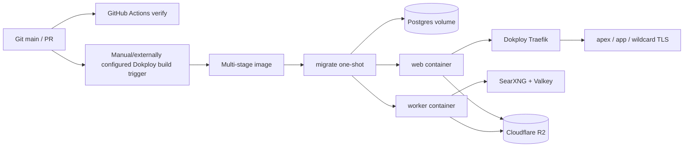

# 05 — Integrations, deployment, CI/CD, and operations

## External dependencies

### Runtime services

| Dependency | Capability/data shared | Failure/timeout/retry | Cost/lock-in/alternative |
|---|---|---|---|
| PostgreSQL 17 / pgx | all mutable product/operational state; personal data | 15s statements; pool; web unready and worker cycle failure; transaction rollback | Essential. Uses standard SQL plus PG locking/JSON/advisory lock; migration cost to another DB is high. |
| S3-compatible storage / AWS SDK | compressed immutable Dossier, namespaced by Account/stream/Issue/generation | SDK behavior plus readiness HeadBucket; app has no explicit retry config; per-process cache | Essential at current design. S3 API makes R2/AWS/MinIO replaceable; egress/storage costs. |
| Clerk / `@clerk/react`, Go SDK | browser identity, subject/session, verified email/status webhooks | SDK-managed token/JWKS; login/provisioning depends on service | High identity lock-in in UI/webhook shapes. Alternatives require auth ADR and migration. |
| OpenAI-compatible model API | prompts include learner intent/history and source evidence; receives no Clerk secret | 10m; retry timeout/429/5xx twice with jitter; 4 concurrent | Largest variable cost/latency. Protocol is replaceable, prompt/model behavior is not portable without quality evaluation. |
| Resend | verified primary email and full generated lesson | 30s; application retries known failures, never ambiguous outcomes; deterministic idempotency | Replaceable behind narrow `Mailer`; sender reputation/provider records need migration. |
| SearXNG + Valkey | generated search queries/topic; candidates only | 8s; degraded discovery recorded; no direct model evidence | Self-host cost/ops replaces paid query fees. Can be disabled or adapter-replaced via ADR. |
| Public source sites | URL, user agent; content is stored as snapshot and sent to model | DNS/connect/header/body/time bounds; conditional caching; source failures can degrade/fail Issue | Essential to grounded product; legal/robots/licensing implications are not encoded. |
| Traefik/Dokploy/DNS/TLS | public host routing and certificates | outside app; wildcard routing required | Current deployment convenience, not application API. |

Primary Go libraries: readability extracts article content; `x/net` supports
HTML/network behavior; `x/sync/errgroup` provides bounded parallel composition;
UUID identifies all domain/claim/incident objects; Svix verifies Clerk
webhooks. React/lucide/fontsource are UI runtime dependencies. Vite/TypeScript/
ESLint/Vitest and Go test/vet/staticcheck are development/build dependencies.
No dependency was found whose runtime purpose is unjustified. `go.sum`/lockfiles
pin transitive versions; GitHub scanner commands marked `latest` are exceptions.

Upgrade risk is highest for Clerk authentication semantics, pgx transaction/
pool behavior, AWS SDK endpoint/checksum behavior, React/Vite major versions,
and readability output. Dependabot covers Go/npm/actions/Docker weekly.

## Source to production



Text equivalent: GitHub CI verifies but does not publish or deploy. The recorded
production Compose asks Dokploy to build the image locally (or use configured
image/tag), run migration after Postgres health, then start web; worker waits
for migration and SearXNG. Web joins the external Dokploy network and Traefik
routes apex, www, app, and username wildcard hosts with TLS. Postgres/Valkey/
SearXNG cache use Docker volumes; Dossiers use external R2. Exact Git-to-Dokploy
trigger/image registry behavior is **unknown** because it is dashboard state,
not repository code.

### Build artifact

1. Node 24 Alpine runs locked `npm ci`, bakes only Clerk publishable key/root
   domain, and builds `web/dist`.
2. Go 1.25.12 Alpine downloads locked modules and builds CGO-disabled,
   trimpathed, stripped `/learnloom`.
3. Distroless Debian 12 nonroot image contains binary + `web/dist`, read-only at
   runtime with 64 MiB noexec/nosuid `/tmp`.

There is no image SBOM, provenance/signature, registry push workflow, or build
commit label in repository.

### Current Dokploy topology

- same Compose stack runs Postgres 17 with persistent volume and no TLS on
  private network;
- Cloudflare R2 is external S3 storage;
- SearXNG custom pinned image and Valkey 9 have persistent cache/data volumes;
- web/worker restart unless stopped; migration does not restart;
- worker gets 20-minute stop grace; application drain uses IssueTimeout + 1m;
- only web joins `dokploy-network`; databases/search are private;
- Traefik compression and HTTPS redirect are configured; wildcard certificate
  acquisition/DNS challenge is external Dokploy setup.

Hosting region, VM size/provider, Postgres volume backups, R2 bucket region,
DNS provider, TLS resolver, resource limits, replicas, and monitoring backend
are **unknown**.

## CI/CD analysis

`.github/workflows/ci.yml` triggers on every PR and pushes to main. One Ubuntu
job has read-only repository permission and a Postgres 17 service. It runs:

1. checkout/setup Go/setup Node (major-tag actions, not commit SHA);
2. `npm ci`, ESLint+TypeScript+production build, Vitest;
3. `gofmt` check, vet, pinned staticcheck 0.7.0;
4. race-enabled all Go tests with real Postgres integration;
5. `govulncheck@latest`, `npm audit --audit-level=high`;
6. production Docker build with placeholder publishable key.

Strengths: real DB lifecycle coverage, race detector, static analysis,
dependency vulnerability checks, locked application installs, minimal workflow
permission, and image build.

Gaps:

- no deploy/publish/promotion/rollback job, environment approval, staging smoke,
  or migration compatibility check;
- no S3 integration service/test in CI (`TEST_S3_*` absent);
- no browser E2E/accessibility/visual/performance regression;
- no Compose validation, SearXNG integration, infrastructure policy test;
- actions use mutable major tags and vuln tool uses `latest`;
- no concurrency cancellation, artifact retention, coverage threshold, SBOM,
  container scan/signing;
- most importantly, CI applies migration 005 in integration tests but does not
  assert `Store.Ready()`, allowing the schema-version-4/5 startup blocker.

Branch protection settings and GitHub secret configuration are external and
unknown. There is no evidence that production deploys automatically from an
unsafe branch; there is also no repository-enforced safe deployment path.

## Deployment runbook

Commands below are repository-supported; provider/dashboard steps are marked.

### Preflight

1. Run `npm ci && npm run check && npm test`.
2. Run `go test -race ./cmd/... ./internal/... && go vet ./...`.
3. Run `docker compose -f compose.dokploy.yaml config` with placeholder-safe
   environment in a secure operator context.
4. Resolve the **confirmed schema readiness blocker** in chapter 07 before any
   deployment; current `main` cannot start against all five migrations.
5. Back up Postgres and verify R2 versioning/recovery according to actual RPO.
6. Confirm Clerk allowed origins/JWKS/webhook, verified Resend sender, model
   `/models`, wildcard DNS/TLS, secrets and release version.

### Apply

Repository-enforced order is migrate → web/worker through Compose dependencies.
Do not start web/worker before successful migration. Run only the immutable
image intended for release. The advisory lock makes concurrent migrators
serialize, but one migration job is operationally simpler.

### Verify

- app host `/healthz` returns ok and `/readyz` returns ready;
- worker private `/healthz`, `/readyz`, `/metrics`; last cycle advances and
  draining is 0;
- apex, www redirect, app auth, and one known public username route through TLS;
- create a staging stream, observe queued→generated, preview artifact, complete
  progress, and (only in staging) verify email;
- query schema version and compare to code’s expected version;
- inspect request IDs/logs for errors, DB pool/S3/model/source metrics.

### Rollback

There are no down migrations. Roll back the image only if its expected schema
and queries are forward-compatible with the applied migration. Otherwise
restore DB and object storage together into an isolated replacement, validate,
then shift traffic. Never automatically replay `delivered` or `unknown`
Delivery rows. Exact Dokploy rollback click/command is **unknown**; confirm it
in the platform and record it before production.

Zero downtime is not proven. Multiple web replicas are stateless except local
cache and can coexist. Workers coordinate through claims and drain safely.
However schema changes need expand/contract compatibility, which the current
forward-only deployment process does not enforce.

## Routine operations

### Pause generation

The supported durable control is SQL through an authorized DB session:

```sql
UPDATE runtime_controls
SET generation_paused = true,
    pause_reason = 'operator incident reference',
    updated_at = now()
WHERE id = true;
```

Resume with `generation_paused=false`, null reason, updated timestamp. This
stops new generation claims, not already claimed work or delivery/deletion.
There is no admin UI/API.

### Backup/restore

**Repository establishes requirements, not commands.** Use provider-approved
Postgres physical/logical backup and R2 versioning/export. A valid restore drill:

1. create isolated network/credentials;
2. restore Postgres at a consistent target time;
3. restore/map the matching artifact bucket;
4. start the exact compatible migrate/web image;
5. verify readiness and sample checksums/previews;
6. inspect pending/delivered/unknown delivery rows before enabling worker;
7. record achieved RPO/RTO.

Never invent `pg_dump` flags without confirming database size/extensions and
provider. There is no cache-clearing operation required for correctness; restart
web processes to clear local artifact/workspace caches if needed.

### Secret rotation

- DB/S3/model/Resend: create overlapping credential when provider supports it,
  update secret injection, roll processes, verify, revoke old credential.
- CSRF secret: rolling replicas with different values cause mutation failures;
  coordinate a short single-version cutover and user profile refresh.
- Clerk webhook: coordinate provider endpoint secret and web rollout; avoid a
  gap. JWT static key should usually remain unset to allow Clerk rotation.
- Vite publishable key/root domain require image rebuild, not runtime restart.

### Data correction/support

There is no admin tool or audit log. Begin read-only: identify Account by Clerk
ID, then trace stream→Issue→attempt/stages→artifact key/checksum→delivery/
progress. Preserve a ticket/request ID and take a backup before writes. Use a
transaction with explicit owner predicates and a peer-reviewed SQL script.
Never edit artifact bytes without a new generation ID/checksum and matching DB
transition. No production correction command can be documented from evidence.

## Incident playbooks

| Symptom | Diagnose in order | Safe response |
|---|---|---|
| Users cannot log in | Clerk status/config; browser network; app CSP; 401 logs/request ID; authorized party/app origin; Account status/webhook | restore config/Clerk; do not manually activate deleted users without identity evidence |
| API 5xx | request ID JSON log; route/status/latency; Postgres/S3 readiness; recent deploy/schema | pause generation if DB pressure; rollback only schema-compatible image |
| Slow requests | HTTP duration logs; DB statement/pool; S3 cache/errors; library/workspace query plans; proxy latency | scale web only after DB capacity; tune proven query/index |
| DB unavailable | app/worker readiness, container/managed DB health, disk/connections, network/credentials | stop writes/workers, restore DB; do not point at stale replica |
| Incorrect data | owner-scoped rows, webhook event order, Issue attempts/frozen sources/checksum, recent migrations | preserve evidence; transactional correction after root cause |
| Deployment failed | migrate exit, schema ledger, readiness expected version, image/frontend file, env validation | keep old compatible services; fix forward; avoid partial manual schema edits |
| Model down | `/models`, provider status, stage failure category/latency, quota | generation pause for sustained outage; queued retries remain durable |
| Source/Search down | source endpoint health, discovery run, SearXNG/Valkey, SSRF/timeout error | provided/hybrid may continue only with minimum; do not weaken SSRF |
| Background job stuck | worker last-cycle/active/drain, Issue claim expiry, attempt/stages, DB locks, timeout | let lease recovery work; drain/restart; never clear token while worker is live |
| Frontend local not prod | built Vite env, hostname classification, CSP/Clerk origin, static index, Traefik route/cache | rebuild for changed `VITE_*`; verify exact host |
| Missing config | startup stderr `configuration:` and role validation; Compose interpolation | inject secret/config and restart; never bake server secrets |
| Email ambiguous | delivery status `unknown`, Resend provider/log ID/idempotency evidence | reconcile manually; do not automatically retry |

## Disaster recovery and scaling controls

The repository defines no automatic failover, cross-region replication,
backups, resource limits or autoscaling. Postgres volume in Dokploy is a single
point of failure. R2 is external but bucket recovery policy is manual. SearXNG/
Valkey outage affects discovery, not authenticated reads or existing lessons.
Model/Resend outages are isolated by queues/state machines.

Before claiming production readiness, record: owner, alert destinations, backup
frequency/retention, quarterly restore evidence, target RPO/RTO, VM recovery,
wildcard DNS/TLS renewal, log retention, escalation contacts and provider
status URLs.
