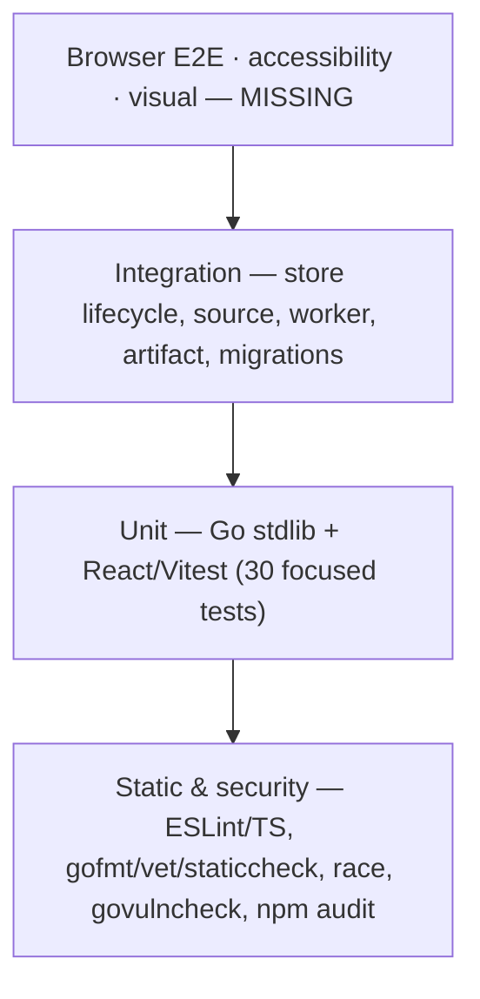

# 06 — Testing, resilience, observability, performance, and scale

## Testing map

| Category | What exists | Important coverage | Principal gaps |
|---|---|---|---|
| Go unit | standard `*_test.go` | config, host/CSRF token extraction, payload safety, source SSRF/parsers/discovery, model retry/contract, quality, artifact compression/cache, delivery idempotency, scheduling/DST | many handler routes and store failure branches |
| Postgres integration | `internal/store/integration_test.go` with `TEST_DATABASE_URL` | full lifecycle/claims/completion/delivery/public reads; source reconciliation/evidence; atomic quota rollback | startup `Ready()`, concurrent multi-worker stress, deletion, large-query plans |
| S3 integration | `internal/artifact/integration_test.go` with `TEST_S3_*` | put/get/delete lifecycle | not run in CI; R2-specific semantics/versioning |
| React/Vitest | 30 focused tests | auth state, API credentials, workspace cache/pagination, lesson projection/completion, publishing/indexing, forms, Core Web Vital dimensions | no browser/router/E2E, most pages/mutations, accessibility/visual |
| Static/build | ESLint, TypeScript, Vite build, gofmt/vet/staticcheck/race | compile and common defects | no minimum coverage |
| Security/deps | govulncheck/npm audit; source-policy unit tests | dependency advisories and SSRF primitives | DAST, fuzz/property, container/IaC scan, authz matrix |
| Migration | migrator unit + migrations applied in integration | transactional lifecycle | expected-version drift (currently broken), rollback/large-data compatibility |
| Performance | a browser Web Vital sanitization test only | safe dimensions | load, query plan, bundle budgets, worker throughput |
| Contract | implicit Go/TS tests | a few request/problem and projection shapes | no OpenAPI/generated types/consumer contract |

There are no E2E, visual regression, infrastructure, chaos, formal
accessibility, or backup/restore tests.

### Business rule to test mapping

- safe public-only source fetch: `source/acquisition_test.go`,
  `service_test.go`;
- evidence freeze and retry determinism: `TestPrepareIssueFreezes*`;
- discovery policy/minimum: provided/hybrid/discovered service tests;
- validated staged generation/checkpoint invalidation/editor recovery:
  `dossier/generator_test.go`;
- duration/citation/practice quality: `dossier/quality_test.go`;
- lease renewal and ambiguous delivery: `execution/worker_test.go`;
- fair lifecycle, owner isolation, retry/delivery/public projection:
  `store/TestPostgresLifecycleIntegration`;
- stream quota atomicity: `TestCreateNewsletterDailyQuotaRollsBackIntegration`;
- private/indexing invariant: store/migration/PublishingPage tests;
- durable completion merge: store integration + frontend learning-state tests;
- auth UI and request credential policy: HostedApp/API tests.

### Highest-priority missing tests for safe AI delegation

> [!IMPORTANT] The one that would have caught today's blocker
> No test asserts that migrating an empty DB produces a `SchemaVersion()` equal
> to the derived highest embedded migration and that `Store.Ready()` then
> succeeds. That missing invariant (P0) let the version-4/5 drift ship.

1. **P0:** migrate an empty DB, assert `SchemaVersion()` equals the derived
   highest embedded migration and `Store.Ready()` succeeds. This would have
   caught current version 4/5 drift.
2. Cross-tenant table-driven integration tests for every API/store operation:
   Account B cannot read/mutate A’s stream, issue, progress, delivery or site.
3. Real HTTP server contract suite covering Origin/CSRF/content-type/body limit,
   statuses, method matrix, host routing and webhook replay.
4. Browser E2E: Clerk test session → create stream → worker fixture → read/
   progress/complete → publish/unpublish.
5. Concurrent multi-worker stress: fair claims, renewal loss, dispatch
   idempotency, checkpoints, drain and Account deletion race.
6. S3 CI using MinIO: checksum/compression, orphan cleanup failure, prefix
   deletion pagination.
7. Migration upgrade from each historical schema with representative data;
   expand/contract compatibility against previous image.
8. Fuzz URL/DNS/redirect/feed/HTML/JSON model output and public renderer.
9. Restore rehearsal automation that blocks email worker until receipts audited.
10. Accessibility/keyboard/axe plus bundle and SQL performance budgets.

## Error handling and resilience

HTTP panics are recovered, stack-logged with request ID, and return safe 500 if
headers are not sent. Store sentinel errors map to stable status; unexpected
errors are logged and hidden. Classified generation failures preserve internal
detail only in operational columns/logs, while UI gets public message, code,
category, stage, retryability and incident ID.

Model retries only request timeout/429/5xx, honoring integer `Retry-After` or
exponential jitter. Structured contract repair is separate from provider
retry. Source acquisition does not blindly retry per request; persistent
catalog/Issue retry supplies a slower retry boundary. Delivery known failures
back off/retry through receipt state; ambiguous failures never replay.

Issue retry safety:

- claim token on every transition/renew/checkpoint;
- evidence freezes once;
- generation checkpoint fingerprint invalidates changed context;
- artifact stored before state references it;
- completion transaction is atomic;
- abandoned claim decreases content attempt count and increments separate
  claim-loss budget;
- delivery has independent receipt and idempotency identity.

Partial failures:

- failure after S3 Put before DB commit triggers object delete; possible orphan
  remains if delete fails;
- successful provider email plus failed DB commit becomes unknown;
- webhook processing failure deletes the idempotency row so Clerk redelivery
  can retry. A concurrent duplicate is ignored while the first event is
  in-flight, and an apparently abandoned unprocessed row can be reclaimed
  after five minutes (`operations.go → BeginWebhook(), CompleteWebhook()`).
- worker cycle logs errors and continues next poll; web init failures stop
  process; migrations stop on first error and transaction rolls back.

No circuit-breaker library exists. Durable `generation_paused` and daily global
limit are manual/spend circuit breakers. No fallback model/provider exists.

## Observability

### Present

- structured JSON `slog` stdout with configurable level;
- HTTP request ID accepts valid UUID or creates one, returns header, logs
  method/path/host/status/duration;
- worker logs cycle/dispatch/recovery and phase/stage durations with Issue ID;
- append-only Issue/Stage attempts persist model/pipeline/release context,
  duration and classified failures;
- web counters: requests/errors/rate-limited;
- worker counters/gauges: cycles/generated/failures/delivery/deletion/recovery/
  renewal/release/active/drain/last cycle;
- health and dependency readiness endpoints;
- browser CLS/INP/LCP emitted as logs with sanitized page dimension.

### Absent

There is no metrics collector configuration, dashboard, alert definition,
distributed tracing, OpenTelemetry, error tracker, correlation ID propagated to
model/source/Resend, central audit log, queue-age metric, DB pool metric, source/
model provider metric series, or documented log query syntax. `metrics` are
in-process counters lost on restart. Operators cannot reliably answer long-term
rates/SLOs from repository assets alone.

Recommended first observability ADR: choose Prometheus/log backend, define
availability and generation SLOs, collect queue oldest age/attempt outcomes/
provider stage histograms/DB pool, and alert on the conditions already listed
in `docs/operations.md`.

## Performance and scalability

### Current behavior

- Web is stateless horizontally except in-memory S3 LRU and frontend caches.
- Worker claims coordinate horizontally through Postgres.
- Source/model concurrency and account fairness are bounded.
- Vite code-splits large pages, uses optimized responsive images, and Go serves
  immutable asset caches.
- Workspace reads four queries concurrently and caches client snapshot five
  minutes; detail JSON and artifacts use ETags/local LRU.
- Keyset cursors avoid offset growth in Issue/library lists.

Likely bottlenecks, in order:

1. model latency/cost and token context across 7–8 stages;
2. public source latency/reliability;
3. Postgres claim fairness aggregates/account activity as Issues grow;
4. S3 latency/cache misses for lesson/public reads;
5. Postgres connections multiplied by replicas;
6. server-rendered public sitemap at up to 49,000 Issues and in-memory HTML.

No query `EXPLAIN` evidence or load tests support numeric capacity claims.

### Scaling path (estimates, not facts)

- **Small user count:** external configuration and source/model failures will
  fail before compute. Single web/worker/Postgres is adequate. Current schema
  version blocker prevents startup until fixed.
- **Hundreds active:** model rate limits/cost and worker concurrency dominate.
  Add worker replicas only within model/DB budgets; central metrics and queue-age
  alerts become mandatory.
- **Thousands active:** claim aggregation, daily dispatch bursts, Postgres pool
  count, source egress and S3 reads need measurement/index review. Separate web
  replicas and worker pools are already supported. Managed HA Postgres becomes
  preferable to a VM volume.
- **Much larger:** partition/archive operational/Issue history, precompute or
  paginate sitemap, measure claim scheduler, add provider capacity controls,
  CDN public immutable artifacts/pages. A separate queue is justified only if
  Postgres claim workload demonstrably harms transactional traffic.

Horizontal constraints: local metrics/cache are per replica; migrations must be
compatible; all workers share global daily count but concurrency is configured
per worker, so `GLOBAL_GENERATION_CONCURRENCY=4` actually becomes 4 × replicas.
The model semaphore is likewise per process. Enforce global provider limits
outside process before large worker scaling.

### Performance verification to add

- `EXPLAIN (ANALYZE, BUFFERS)` on claim, workspace, library and public queries
  with realistic cardinality;
- k6/Vegeta authenticated/public traffic and worker queue simulations;
- bundle chunk budget and Lighthouse/real-user percentiles;
- model tokens/cost/stage latency and source success/staleness distributions;
- pool saturation, queue oldest age and artifact-cache hit rate.
