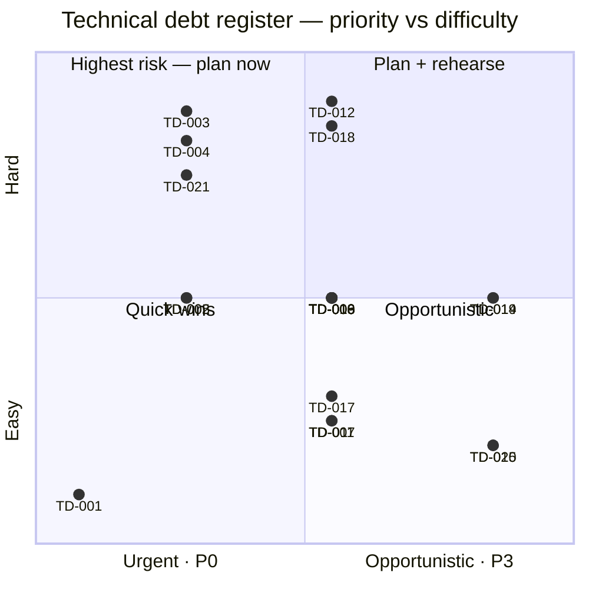

# 07 — Code quality, technical debt, risks, unknowns, and contradictions

## Executive assessment

> [!NOTE] Confirmed strengths
> - Coherent hosted target architecture with recorded ADRs and unusually strong
>   async idempotency / source-safety design.
> - Transactions align with real invariants, not arbitrary service layers —
>   worker claims, evidence freeze, artifact-before-completion, separate
>   delivery, and safe failure projection are thoughtful production patterns.
> - Capability-oriented packages, explicit composition, and no speculative
>   provider abstractions.
> - Tests concentrate on the hard behavior: concurrency, ambiguous delivery,
>   source safety, content contracts, DST, ownership and migration lifecycle.
> - The runtime image and request surfaces have good baseline hardening.

> [!WARNING] Confirmed weaknesses
> - Migration 005 shipped without updating the hardcoded expected schema
>   version → the current revision is **operationally non-starting** after
>   migrate, and CI has no invariant to catch it.
> - HTTP routing/contracts and frontend types are manual and weakly linked.
> - Deep persistence module with very large files (`issues.go` 1,297;
>   `control.go` 1,139; `generator.go` 943) — real, but raises review load.
> - Operations documents describe alerts/backups, but no monitoring, backup,
>   deploy or restore implementation is versioned here.
> - Privacy retention, auditability, and admin/support tooling are incomplete.

## Intentional design versus accidental complexity

| Characteristic | Assessment | Why |
|---|---|---|
| Three roles in one binary | Intentional, good | recorded ADR; shared code with independent scaling and small deployment surface |
| Postgres as queue | Intentional trade-off | claims/transactions/fairness are core; avoids extra service but increases SQL complexity |
| Multi-stage model pipeline | Intentional product complexity | each stage/quality/checkpoint has concrete learning/recovery purpose |
| `newsletters.sources` + `source_specs` | Transitional/accidental debt | migration preserved compatibility JSON while normalized catalog became truth |
| Custom frontend router/cache | Deliberate simplicity, now fragile | small app avoided dependency; edge cases/types/caching are hand-maintained |
| Global CSS across several files | Evolved/accidental | multiple redesign eras, no explicit token contract |
| Large control/store files | Under-modularized locally | capability cohesion is real, but route/projection/SQL subsections exceed easy review size |
| Browser-only review state | Product limitation | no server review table; cross-device behavior differs |
| Hardcoded schema version | Accidental and currently broken | migration 005 commit did not update constant |

No circular Go package dependencies exist (Go would reject them). No runtime
process spawning, hidden filesystem state, or duplicate live backend
implementation remains. Historical branches contain legacy approaches but are
not shipped.

## Technical debt register

Priority: P0 blocks safe operation; P1 high risk; P2 important; P3 opportunistic.
Difficulty is relative.

| ID/type | Item and evidence | Impact/risk | Priority/difficulty | Action |
|---|---|---|---|---|
| TD-001 Bug | schema expected 4 vs migration 005 (`store.go`, `005_*`) | web/worker readiness failure after migration | **P0 / trivial** | update/derive version; add all-migrations readiness regression; fix now |
| TD-002 Testing | no cross-tenant HTTP/store matrix | future query omission can leak tenant data | **P1 / medium** | table-driven integration suite; fix now |
| TD-003 Operations | no versioned deploy/backup/restore/alerts | recovery and incident response unproven | **P1 / high/external** | capture platform config and drill evidence before production |
| TD-004 Privacy | deletion retains DB personal data (`accounts.go`) | user/legal expectation mismatch | **P1 / high** | decide retention ADR; implement purge/anonymization; fix before regulated use |
| TD-005 Reliability | no S3 integration in CI | artifact break may ship | P1 / medium | MinIO CI service/test |
| TD-006 Contract | implicit Go↔TS JSON, `any` types | silent frontend breakage | P2 / medium | OpenAPI/schema or shared generated types; typed problems |
| TD-007 Security | metrics public on app host | operational disclosure/attack surface | P2 / low | proxy/private metrics endpoint |
| TD-008 Reliability | global concurrency is per worker | scale-out can exceed model/provider budget | P2 / medium | document replica budget; durable/global semaphore if needed |
| TD-009 Maintainability | large `control.go`, `issues.go`, `generator.go` | difficult review and AI-generated inconsistency | P2 / medium | split by cohesive feature without adding pass-through layers |
| TD-010 Data | JSON source compatibility duplication | divergence risk | P2 / medium | declare canonical source_specs; migrate callers/remove JSON via ADR |
| TD-011 Config | malformed numeric/durations silently default | operator believes a limit applied when it did not | P2 / low | strict parsing with actionable startup errors |
| TD-012 Observability | ephemeral counters/no backend/SLO | cannot measure historical reliability | P2 / high/external | observability ADR + collector/dashboards/alerts |
| TD-013 Product | review state browser-only | lost/cross-device inconsistent progress | P2 / medium | decide whether review is durable product state |
| TD-014 Reliability | possible S3 orphan after failed delete | storage leak, not incorrect reads | P3 / medium | periodic mark/sweep against DB keys |
| TD-015 Feature | PDF enum/schema but no fetch implementation | confusing contract/rejected sources | P3 / low | remove until supported or implement safely via ADR |
| TD-016 Performance | no query/load/bundle budgets | regressions discovered in production | P2 / medium | representative benchmarks and query-plan fixtures |
| TD-017 Security | no HSTS in app | depends entirely on edge | P2 / low/external | assert Traefik/CDN HSTS |
| TD-018 Audit | public moderation has a durable audit and exact hold command; broader settings/data-correction administration still has no general tool | weak support/forensics outside public moderation | P2 / medium | design least-privilege workflows only for evidenced support cases |
| TD-019 DX | dev requires wildcard TLS/Clerk but automation absent | onboarding friction | P3 / medium | local proxy/bootstrap script without storing secrets |
| TD-020 CI | mutable action majors and scanners latest | build verification drift | P3 / low | pin SHA/tool versions and automate updates |
| TD-021 Operations | PR #28 replaced production MinIO with R2; review warned existing objects needed copy/validation/rollback, while merged PR only states referenced keys must exist | historical artifacts could be unavailable if a live bucket had data | P1 if cutover was live / external | verify whether production contained objects; retain/migrate old volume until checksums and rollback are proven |

## Specific maintainability observations

- `internal/domain/domain.go` is a useful shared vocabulary, but business rules
  are distributed. This is correct for transactional/pipeline rules; do not
  “centralize” them into an anemic service merely for folder symmetry.
- Store query strings are verbose but auditable. Extracting every query into a
  generic repository would hide invariants. Better splits are by state machine
  (`issue_claims.go`, `issue_completion.go`, projections) with integration tests.
- `httpapp/control.go` can split routing registration, stream handlers, issue
  handlers and payload DTOs. Standard `http.ServeMux` patterns could replace
  manual path slicing without a framework.
- `web/src/types.ts` makes nearly every field optional even when endpoints
  guarantee it. This accommodates multiple projections but pushes errors into
  views. Separate endpoint DTOs would clarify contracts.
- `learningState.syncLessonProgress()` never lowers local progress. Good for
  optimistic UX, but it prevents a legitimate server correction/reset from
  propagating; this policy is undocumented.
- Store migration `currentSchemaVersion` is manually synchronized. This is a
  classic AI-agent hazard: a file addition looks complete while a distant
  invariant is missed.

## Contradictions

1. **Current schema:** migration ledger has five files, runtime expects four.
   This is direct contradictory evidence and P0.
2. **README “no offline demo”:** production backend has no demo, but
   `npm run demo`, `DemoHostedApp.tsx`, and `demoData.ts` provide a development
   browser demo. Interpret README as runtime/SaaS statement, not repository-wide.
3. **ADR-0005/local Compose:** ADR says SearXNG/Valkey run only under Compose
   `discovery` profile. That is true in `compose.yaml`, but Dokploy production
   services have no profile and always run. The ADR predates/overgeneralizes
   production topology.
4. **README deployment description:** it recommends managed Postgres; current
   Dokploy Compose runs local volume Postgres. Both are supported intentions,
   but recorded production shape is self-contained VM plus R2.
5. **Config workload identity:** README says omit static S3 credentials on AWS,
   while both Compose files require them through interpolation. Direct binary/
   other orchestration supports workload identity; Compose templates do not.
6. **Schema version test:** `migrate_test.go` verifies the migration filename/
   SQL property but not runtime expected version, so tests and deploy behavior
   disagree by omission.
7. **`SourceKindPDF`:** declared valid domain/schema kind; acquisition switch
   rejects it as unsupported.
8. **`CLERK_PUBLISHABLE_KEY`:** server config requires it but Go does not use it;
   browser separately consumes `VITE_CLERK_PUBLISHABLE_KEY`.

## Unknowns

| Question | Inspected evidence | Why unresolved / danger | What resolves it |
|---|---|---|---|
| Is production currently deployed and healthy? | Compose/docs/Git only | runtime state inaccessible; dangerous given schema blocker | Dokploy service/migration logs and health |
| Exact hosting provider/region/VM/resources? | Dokploy guide/Compose | dashboard-owned; affects latency/DR | exported Dokploy/infrastructure inventory |
| DNS/TLS/wildcard certificate setup and HSTS? | Traefik labels | resolver/provider config external | Traefik/Dokploy config and header probe |
| Backup frequency, retention, RPO/RTO, restore success? | aspirational ops docs | no automation/evidence; high danger | provider policies and dated restore report |
| Central logs/metrics/alerts/on-call? | app endpoints only | no backend configs | monitoring workspace/export/runbook |
| Branch protection/deploy trigger/image registry? | CI has no deploy | GitHub/Dokploy settings external | settings export/screenshots/API |
| Clerk cookie/session/MFA/bot settings? | SDK integration | provider settings external | Clerk production instance review |
| R2 encryption/versioning/lifecycle/CORS/token scope? | endpoint/template | bucket settings external | Cloudflare bucket/API-token audit |
| Model provider actually used and data retention terms? | runtime `MODEL_BASE_URL` and `MODEL_NAME` remain deployment-controlled | runtime env/legal agreement external | deployed env names (not secrets), DPA/provider config |
| Is the public-source policy operationally and legally defensible at launch? | [ADR-0007](../adr/0007-public-source-retrieval-policy.md) allows public retrieval when `robots.txt` is absent while forbidding access-control bypass and preserving attribution/removal | counsel review and real complaint-response evidence remain external | counsel approval plus tested rights-holder intake/removal runbook |
| Expected data-deletion semantics? | artifacts deleted, DB retained | intent not recorded; high privacy consequence | product/legal requirement and ADR |
| Cost per lesson/capacity budget? | token/concurrency limits | no telemetry/rates | stage token/cost metrics and provider plan |
| Whether old branches/PR discussions include decisions not merged? | local branches/log, no PR API review | commit history available, discussion metadata not local | GitHub PR/issue archive review |
| Actual users/workload/query cardinalities? | no production telemetry | scale assessment remains estimate | anonymized metrics/query statistics |
| Did the MinIO→R2 cutover preserve all existing artifacts? | PR #28 body and automated review warning; current Compose has no MinIO volume | repository does not prove a copy occurred; dangerous only if old production held objects | R2 key/checksum inventory, old volume/backup and deployment record |

## Questions for the owner

1. Is the current Dokploy stack live, and did migration 005 already run?
2. Should “delete Account” erase database learning/source history, and within
   what deadline?
3. Is a Personal Site public by link meant to remain noindex until separate
   consent? Current implementation says yes.
4. Are review reminders important across devices? If yes, browser-only state is
   not the intended model.
5. Which model/provider/region/data-retention contract is acceptable for
   learner/source content?
6. What RPO/RTO and email reconciliation policy can the business defend?
7. Is managed Postgres the intended target or is single-VM Postgres accepted?
8. What monthly generation budget and worst acceptable queue delay should
   control concurrency/scaling?
