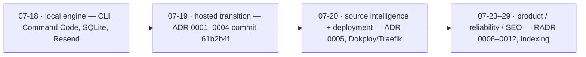

# 10 — Architecture decision catalogue

## How to read this catalogue

> [!NOTE] Recorded vs reconstructed
> **Recorded** entries summarize committed ADRs (motive stated as fact).
> **Reconstructed** entries distinguish the observed decision from its plausible
> motive. Confidence concerns historical reasoning, not whether code exists.

“Recorded” entries summarize committed ADRs and may state motivation as fact.
“Reconstructed” entries distinguish observed decision from plausible motive.
Dates come from Git history. Confidence concerns historical reasoning, not
whether current code exists.

## Recorded ADRs

### ADR-0001 — Hosted Go runtime only

- **Status/date:** accepted; 2026-07-19 (`61b2b4f`).
- **Context/problem:** the product moved from a local/self-hosted CLI with
  schedulers/filesystem/demo compatibility to pre-launch hosted SaaS.
- **Decision:** Go backend with exactly web/worker/migrate roles; React static
  browser; delete local CLI/scheduler/filesystem/offline production demo.
- **Evidence:** `docs/adr/0001-hosted-go-runtime.md`; `cmd/learnloom/main.go`;
  history before/at `61b2b4f`.
- **Consequences:** one hosted test surface and env-only config; local dev needs
  production-shaped dependencies. Simple artifact, but shared deploy can couple
  releases. Go improves concurrency/static binary; React retains rich UI.
- **Alternatives rejected:** backward-compatible local/self-hosted modes,
  multi-runtime legacy implementation.
- **Operational/security/cost:** fewer runtime paths and no local executable
  provider boundary; separate role scaling. Requires hosted infrastructure.
- **Revisit when:** a credible offline/on-prem product requirement pays for a
  separate supported architecture—not a compatibility flag.
- **Current assessment:** sound. Do not resurrect legacy paths casually.

### ADR-0002 — Postgres and S3-compatible durable state

- **Status/date:** accepted; 2026-07-19.
- **Problem:** SQLite/JSON/filesystem paths could not provide coherent
  transactions, horizontal worker claims or one recovery story.
- **Decision:** concrete Postgres for mutable state/queue and S3-compatible
  immutable artifacts; embedded advisory-locked migrations; no legacy adapter.
- **Evidence:** ADR; `internal/store`, `artifact`, migrations.
- **Trade-offs:** strong transactions/coordination and standard object API;
  requires two-store coordinated backups and permits orphan window. Postgres is
  now availability/scaling center.
- **Alternatives:** SQLite/filesystem; separate queue; DB blobs. Recorded ADR
  explicitly rejects first; others are plausible alternatives, not stated.
- **Security/cost:** infrastructure encryption/IAM required; R2/MinIO/AWS
  portability; DB and object-store operations cost.
- **Revisit when:** measured claim workload harms OLTP, artifacts fit a
  different retention/access model, or recovery objectives cannot coordinate.
- **Current assessment:** sound for current scale; fix restore automation.

### ADR-0003 — Concrete external adapters

- **Status/date:** accepted; 2026-07-19.
- **Decision:** HTTPS OpenAI-compatible model, Clerk, Resend and one safe source
  acquisition boundary; remove process/Command Code/provider-kind/demo runtime.
- **Evidence:** ADR; `dossier/model.go`, `delivery/resend.go`,
  `source/http.go`, Clerk/Svix handlers.
- **Trade-offs:** fewer drifting paths and clear security policy; Clerk/Resend
  are vendor choices. OpenAI protocol offers some model portability.
- **Revisit when:** a second provider has a funded requirement and materially
  different semantics. Introduce via ADR, not speculative interface.
- **Current assessment:** strong. Mailer/model interfaces are appropriately
  narrow test/change seams.

### ADR-0004 — Deep hosted modules

- **Status/date:** accepted; 2026-07-19.
- **Decision:** modules by product capability; HTTP policy centralizes host/
  auth/tenant/CSRF; execution owns lifecycle; Dossier owns full content; reading
  owns public surface. Avoid shallow pass-through packages.
- **Evidence:** ADR and current package dependency graph.
- **Positive:** important invariants have one locality; interfaces test behavior.
- **Negative:** deep modules contain very large files. Capability boundary does
  not require one-file implementations; local cohesive splitting is warranted.
- **Revisit when:** package coupling/cycles or independent deployment/data
  ownership becomes real. Do not create microservices for file-size relief.
- **Current assessment:** decision remains right; internal organization needs
  modest decomposition.

### ADR-0005 — Catalog-first autonomous source intelligence

- **Status/date:** accepted; 2026-07-20 (`69978ca`).
- **Decision:** discovered/provided/hybrid; self-hosted SearXNG; search only
  below target; snippets are candidates; deterministic bounded resolution;
  native safe fetch; immutable snapshots and Issue freeze; retry reuses evidence.
- **Evidence:** ADR; migration 002; `source/service.go`, discovery tests.
- **Alternatives:** paid search/general browser agents explicitly rejected for
  cost/non-determinism/security boundary.
- **Trade-offs:** grounded/reproducible and provider-light, but operates
  SearXNG/Valkey and inherits upstream search throttling. Source content is
  stored/sent to model, with legal/privacy implications.
- **Revisit when:** source success/quality data shows search inadequacy, legal
  requirements change, or paid API cost is justified.
- **Current assessment:** sophisticated and appropriate. Clarify production
  profile wording and PDF non-support.

## Reconstructed ADRs

### RADR-0006 — Postgres-backed durable queue instead of a broker

- **Status/date:** accepted in code; approximately 2026-07-19 onward.
- **Observed decision:** Issues, deliveries and deletion use status/available/
  claim/expiry rows with `SKIP LOCKED`; no Redis/SQS/Kafka.
- **Evidence:** migrations 001/003; `store/issues.go`, `deliveries.go`,
  `operations.go`; commits “Harden Workspace schema and claims,” hosted migration.
- **Most plausible reasons (strong inference):** atomic product-state
  transitions and queues in one transaction, low operational service count,
  expected modest workload.
- **Unknown:** whether broker alternatives were explicitly evaluated.
- **Alternatives:** SQS, Redis queues, Kafka, in-process scheduler.
- **Consequences:** simple delivery/consistency, excellent recovery evidence;
  SQL complexity and Postgres contention. Horizontal worker safe.
- **Security/cost:** one credential/data plane; DB must be highly available.
- **Revisit:** measured queue/claim queries threaten transactional SLO or need
  event fan-out/very high throughput.
- **Assessment/confidence:** still sensible; high confidence in plausible logic,
  not historical intent.
- **Questions for formal ADR:** target throughput/latency, DB budget, broker
  operational appetite, cross-transaction outbox semantics.

### RADR-0007 — Client SPA for control, server rendering for public reading

- **Status/date:** evolved 2026-07-19 React dashboard/personal sites through
  current TypeScript migration.
- **Observed:** authenticated UI is Vite React SPA/custom router; public/SEO
  pages are Go-rendered HTML.
- **Evidence:** `web/src/main.tsx`, `App.tsx`; `httpapp/reading.go`, SEO files;
  commits `06f2525`, `607be3e`, `4d773be`, SEO commits.
- **Plausible reason:** interactive private app benefits from React; public
  pages need immediate crawlable metadata without introducing Next.js/second
  server runtime.
- **Alternatives:** all SPA, all Go templates, Next/Remix SSR.
- **Consequences:** small runtime and good public SEO; two rendering/styling
  systems and duplicated public decoration.
- **Revisit:** public UI becomes highly interactive or SPA routing/data needs
  outgrow custom implementation.
- **Assessment/confidence:** good for scope; medium-high inference confidence.

### RADR-0008 — Clerk Account projection plus webhook lifecycle

- **Status/date:** hosted migration 2026-07-19; auth UI expanded 2026-07-24–26.
- **Observed:** just-in-time Account ensure plus ordered signed webhook email/
  status/deletion projection; Clerk remains identity authority.
- **Evidence:** `server.go`, `webhook.go`, `accounts.go`, Clerk commits.
- **Plausible reason:** avoid local credentials while preserving relational
  owner FK/status/email and durable deletion effects.
- **Trade-offs:** clean identity boundary and verified email; provider lock-in,
  eventual webhook lag, two provisioning paths. Security depends on correct
  Clerk dashboard.
- **Alternatives:** local auth, Auth0/Supabase, JWT-only without projection.
- **Revisit:** enterprise federation/roles/data residency/provider economics.
- **Assessment/confidence:** sound; high.

### RADR-0009 — Immutable compressed artifacts with DB metadata and local LRU

- **Status/date:** S3 ADR base 2026-07-19; performance/cache/compression commits
  2026-07-24 and 27 (`2a7dec4`, `0969758`).
- **Observed:** canonical artifact JSON includes rendered forms, gzip in S3,
  SHA/bytes in Issue, opaque generation key, per-process LRU.
- **Plausible reason:** generated lesson is immutable and expensive to rebuild;
  object store is cheaper than DB blobs; compression/ETag/cache reduce latency/
  R2 storage/egress.
- **Alternatives:** DB JSONB/blob, render on each request, CDN-only.
- **Consequences:** fast stable reads and integrity metadata; coordinated backup
  and orphan risk, per-replica cache.
- **Revisit:** access patterns justify CDN/pre-render split or schema evolution
  makes stored HTML burdensome.
- **Assessment/confidence:** good; high.

### RADR-0010 — Conservative ambiguous delivery outcomes

- **Status/date:** email phase 2026-07-18/19; hardened by `345b4f4`.
- **Observed:** provider idempotency per Issue/generation; any uncertainty after
  request becomes `unknown`, never auto-replayed.
- **Plausible/commit-supported reason:** duplicate email is worse than missed
  automatic delivery when provider acceptance cannot be proven.
- **Evidence:** `delivery/resend.go`, `execution/worker.go`, tests, architecture.
- **Alternatives:** at-least-once retry, provider reconciliation API, outbox
  webhook.
- **Consequences:** safe recipient experience; operator must reconcile unknown,
  potential missed mail.
- **Revisit:** Resend offers durable lookup/webhooks that can resolve outcome.
- **Assessment/confidence:** excellent; high.

### RADR-0011 — Checkpointed multi-agent-like content pipeline with deterministic gate

- **Status/date:** quality phase 2026-07-19, checkpoints/recovery 2026-07-27.
- **Observed:** multiple role prompts, structured contracts/repair, deterministic
  gate, context fingerprint, valid-stage reuse and editor fallback.
- **Evidence:** generator/quality/failure packages and commits.
- **Plausible reason:** one-shot model output could not reliably satisfy
  grounding, pedagogy, continuity and answer contract; checkpoints reduce repeat
  cost after failure.
- **Alternatives:** single prompt, tool-agent loop, human editor.
- **Trade-offs:** quality/recovery evidence versus 7–8 calls, latency/cost and
  code/prompt complexity.
- **Revisit:** measured model quality supports simpler pipeline, or cost/latency
  violates product SLO.
- **Assessment/confidence:** technically strong but requires telemetry; high.

### RADR-0012 — Explicit indexing consent separate from public visibility

- **Status/date:** 2026-07-29 (`4c79240`).
- **Observed:** site can be public but `noindex`; indexing requires public,
  gates sitemap/robots/header.
- **Evidence:** migration 005; `PublishingPage`, `reading.go`; SEO docs.
- **Plausible reason:** public-by-link is not equivalent to consent for search
  discovery; also avoid indexing empty sites.
- **Alternatives:** public implies indexed; global noindex; per-lesson index.
- **Consequences:** better privacy/control, more settings/UI/schema complexity.
- **Revisit:** product policy changes or granular per-stream indexing required.
- **Assessment/confidence:** good; medium-high. Implementation commit caused
  unrelated schema-version drift that must be fixed.

## Historical narrative

Git history shows four clear eras:

1. **2026-07-18 local engine:** source-grounded CLI, Command Code, self-hosted
   packaging, SQLite workspace/dashboard, local scheduling and Resend.
2. **2026-07-19 quality and hosted transition:** staged content quality, React
   dashboard, Personal Sites, then commit `61b2b4f` deletes compatibility and
   migrates to hosted Go SaaS with ADRs 0001–0004.
3. **2026-07-20 source intelligence/deployment:** normalized catalog,
   autonomous discovery, Dokploy/Traefik/Clerk hardening.
4. **2026-07-23–29 product/reliability/SEO:** learning-experience redesign,
   TypeScript/performance/cache, auth polish, checkpoints/progress/compression,
   public SEO/indexing.

Do not describe the legacy choices as current architecture. They are valuable
evidence for why the hosted ADRs explicitly reject compatibility.

Merged PR bodies reinforce the chronology: #1 local Command Code engine; #2
self-hosted immutable-run/email foundations; #3 SQLite multi-stream worker; #4
durable ambiguous delivery; #5 quality pipeline; #6 hosted Go migration; #16
Dokploy; #17 time fit; #28 R2; #29 responsive asset performance. PR #28’s
automated review also raised an unresolved historical cutover question: an
existing MinIO object set needed copying and checksum/rollback validation before
removal. The merged PR says existing DB keys must exist in R2 but repository
evidence does not prove such a copy occurred. This is an operational unknown,
not proof of data loss.

## Recommended future ADRs

| Decision | Trigger | Options/evaluation evidence | Reversibility / premature risk |
|---|---|---|---|
| Production database topology | real users or VM risk unacceptable | local volume vs managed HA; RPO/RTO, cost, latency, ops | migration moderate; delaying backup decision is dangerous |
| Deletion/retention policy | before public/regulated use | hard delete, timed purge, anonymize; legal/product/support needs | data deletion irreversible; decide requirements first |
| Observability/SLO platform | before production support | Prometheus/Grafana, hosted vendor, OTel; cost/query/retention/on-call | instrumentation portable if OTel; do not collect sensitive prompts |
| API contract generation | next material API growth | OpenAPI hand/Go generated/schema-first; TS strictness/tooling | reversible; avoid huge framework for current small API |
| Global capacity/rate control | >1 worker or provider caps | DB semaphore, external limiter, provider quota; queue SLO/cost | moderate; current per-process limits unsafe at scale |
| Queue separation | measured DB contention/fan-out | retain PG, SQS, Redis, Kafka; transactional outbox/recovery/ops | expensive; deciding now is premature |
| Public delivery/CDN | public traffic/cache cost | current Go+S3, CDN HTML/artifact, static publication | moderate; collect hit/latency first |
| Durable review model | users expect cross-device review | browser state, progress table extension, spaced-repetition table | product semantics hard to undo; research first |
| Auth evolution/roles | teams/admin/enterprise requirement | Clerk organizations/roles, local ACL model, alternate IdP | high migration/security risk; formal threat model |
| Source legal policy | before broad crawling | robots enforcement, allowlist/licensing, retention limits | product/legal constraint; do not infer from technical SSRF policy |
| Model/provider data governance | provider/region change | hosted APIs, self-hosted, gateway; quality/privacy/cost | model output varies; benchmark corpus required |
| Schema rollout strategy | first destructive migration/multiple replicas | expand-contract, compatibility CI, migration service | process decision highly valuable before need |
