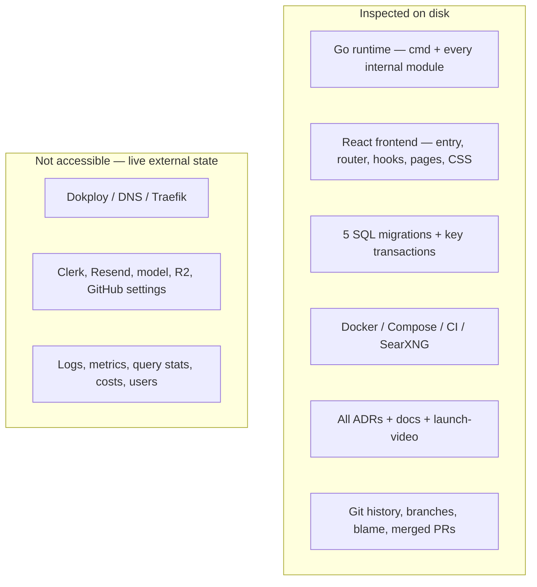

# 11 — Investigation coverage and self-review

## Snapshot and method

Investigation was performed against local `main` at `e89ff26` on 2026-07-30.
The working tree was clean before this handbook. Search excluded local
`node_modules`, build output and media bytes. No `.env` secret values were read
or copied; only templates and code references were inspected.

The investigation:

- inventoried all tracked files with `rg --files` and line counts;
- read runtime composition, config validation and every module’s exported/
  important unexported symbols;
- followed HTTP routing to frontend callers and owner-scoped store effects;
- read all five SQL migrations and key transaction/claim queries;
- followed worker calls through source, Dossier, artifact and delivery;
- enumerated every Go/Vitest test and CI command;
- read Docker/Compose/SearXNG/GitHub workflow/deployment/operations config;
- read all recorded ADRs and current architecture/README;
- reviewed chronological Git log, branches, blame, merged/open PR catalogue,
  major merged PR bodies/reviews, and patches around major decisions,
  especially migration/schema and MinIO→R2 changes;
- inspected frontend entry/auth/router/API/hooks/state/types/pages and asset
  behavior;
- reviewed launch-video manifests/readmes/source inventory as ancillary,
  confirming it does not enter runtime;
- reviewed existing SEO/UX/operations/deployment documentation for stated
  intent, then checked claims against code.

## File-area coverage

| Area | Inspected | Result |
|---|---|---|
| `cmd/learnloom` | all files | all runtime entry/start/shutdown/metrics paths traced |
| `internal/config` | implementation/tests/docs | complete env inventory and role validation |
| `internal/domain`, `failure` | implementation/tests | vocabulary/state/failure projections |
| `internal/httpapp` | all implementation symbol paths and major bodies; all tests enumerated | all live route families, auth/CSRF/host/public/SEO behavior |
| `internal/store` | all migrations; every method/symbol; key SQL bodies; all tests | schema, owner scope, state machines, transactions, migration bug |
| `internal/execution` | full worker and tests | cycle/claim/generation/delivery/deletion/drain |
| `internal/source` | service/HTTP/discovery/acquisition/parsers and tests | safety/catalog/freeze/discovery; PDF gap |
| `internal/dossier` | generator/model/quality/render symbols/bodies/tests | stages/contracts/checkpoints/rendering |
| `internal/artifact`, `delivery` | implementation/tests | compression/cache/S3/idempotent email |
| `web/src` | all file inventory; entry/auth/router/API/hooks/state/types/pages and tests | frontend architecture/callers/contracts; visual CSS summarized |
| root manifests | README, Go/npm locks/manifests, TS/ESLint/Vite, Docker/Compose/env templates | build/dependency/config/deploy shape |
| `.github` | CI and Dependabot | triggers/jobs/permissions/gaps |
| `infra/searxng` | Docker/settings | private search topology/dependency |
| `docs` | architecture, all ADRs, operations/Dokploy, launch/SEO/UX supporting docs | intent/history/contradictions |
| `launch-video` | manifests/readmes/scripts/source inventory, not media playback | correctly classified as isolated marketing tooling |
| Git | local all-branch log/blame/remotes | four historical eras and decision commits |

## Limitations / inaccessible evidence

- Production/Dokploy, DNS, Cloudflare, Clerk, Resend, model provider, database,
  bucket, monitoring and GitHub settings were not connected. Their live state,
  secrets, resources, audit logs and reliability cannot be asserted.
- GitHub CLI access provided PR catalogue plus selected major merged PR bodies
  and reviews. Exhaustive line comments/issues/project discussions were not
  audited; automated review prose was treated as a lead/unknown, not as proof
  that a production condition existed.
- No production logs, metrics, query statistics, cost data, user counts or
  incidents were available, so scalability conclusions are labeled estimates.
- Media images/audio/video were not relevant to runtime architecture and were
  inventoried rather than semantically reviewed frame by frame.
- Lockfiles were used to establish dependency versions; every transitive
  package source was not manually audited.
- Existing `.env` was intentionally not read to avoid secret exposure.

## Cross-reference audit

- **Every runtime:** web, worker, migrate, Vite/browser, local Compose,
  SearXNG/Valkey and CI documented.
- **Every major table:** all 19 application tables plus migration ledger appear
  in chapter 03 with writers/readers/workflows/constraints.
- **Every API:** all live control/public/health/webhook route families appear in
  chapter 02 with callers and effects.
- **Authentication vs authorization:** separately traced in chapter 04.
- **Deployment claims:** tied to Dockerfile/Compose/CI; dashboard-owned facts
  marked unknown.
- **ADRs:** five recorded and seven reconstructed; reconstructed motivation is
  explicitly probabilistic.
- **Unknowns/contradictions:** dedicated chapter 07.
- **Learning plan/questions/interviews:** specific files/workflows in chapter 09.
- **Safe AI review:** migration-version, owner-scope, API DTO, config/Compose,
  retry/idempotency and deployment checklists included.

## Final self-review findings

1. The existing architecture description is broadly accurate, but it missed
   the live migration readiness contradiction.
2. No hidden second runtime or production CLI was found.
3. Source safety and queue/delivery recovery claims are supported by both code
   and targeted tests.
4. Operational readiness is described aspirationally but cannot be confirmed
   without external platform evidence.
5. The documentation avoids claiming historical motives for reconstructed
   decisions, production scale, security exploitability, backup success or the
   owner’s personal authorship.

## Documentation maintenance rule

> [!IMPORTANT] Keep the handbook in the same PR
> Any change to migrations, roles, routes, state machines, providers,
> environment variables, Compose/CI, or user journeys must update the relevant
> handbook chapter in the same pull request. A lightweight CI link/check can
> verify Markdown, but technical accuracy still requires reviewers to follow the
> evidence paths.

Any change to migrations, roles, routes, state machines, providers, environment
variables, Compose/CI or user journeys must update the relevant handbook chapter
in the same pull request. A lightweight CI link/check can verify Markdown, but
technical accuracy still requires reviewers to follow the evidence paths.
